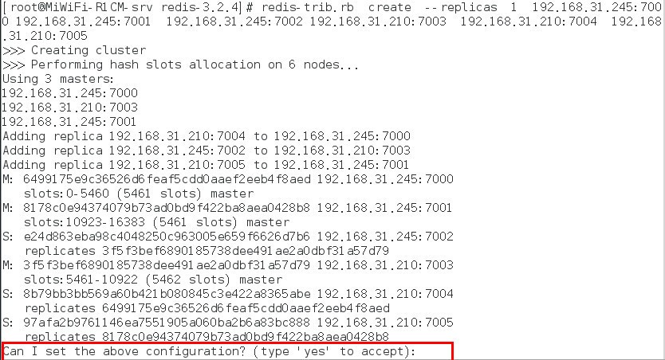
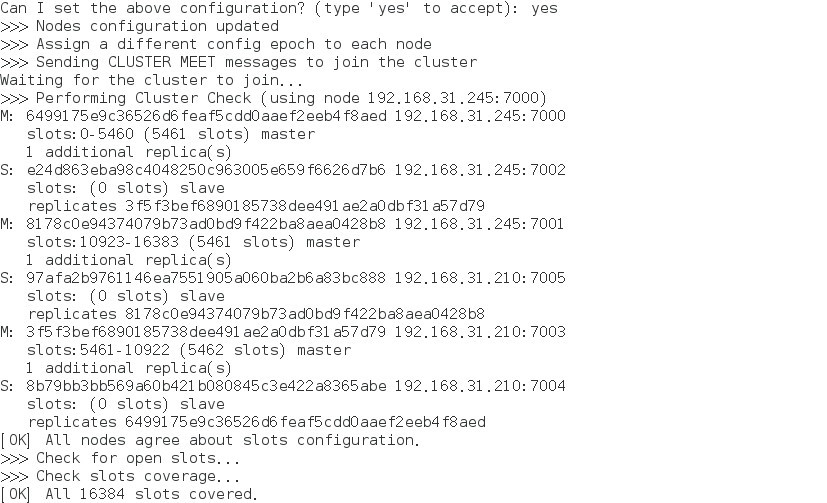
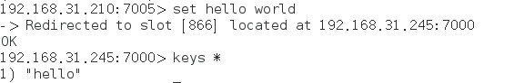
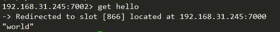

# redis cluster安装

## 下载并解压

```
cd /root/software
wget http://download.redis.io/releases/redis-3.2.4.tar.gz
tar -zxvf redis-3.2.4.tar.gz　
```

## 编译安装

```
cd redis-3.2.4
make && make install
```

## 将redis-trib.rb复制到/usr/local/bin目录下

```
cd src
cp redis-trib.rb /usr/local/bin/　
```

## 创建 Redis 节点

首先在 192.168.31.245 机器上 /root/software/redis-3.2.4 目录下创建 redis_cluster 目录；

```
mkdir redis_cluster　
```

在 redis_cluster 目录下，创建名为7000、7001、7002的目录，并将 redis.conf 拷贝到这三个目录中

```
mkdir 7000 7001 7002
cp redis.conf redis_cluster/7000
cp redis.conf redis_cluster/7001
cp redis.conf redis_cluster/7002　　
```

分别修改这三个配置文件，修改如下内容

```
port  7000                           //端口7000,7002,7003        
bind 本机ip                                       //默认ip为127.0.0.1 需要改为其他节点机器可访问的ip 否则创建集群时无法访问对应的端口，无法创建集群
daemonize    yes                               //redis后台运行
pidfile  /var/run/redis_7000.pid          //pidfile文件对应7000,7001,7002
cluster-enabled  yes                           //开启集群  把注释#去掉
cluster-config-file  nodes_7000.conf   //集群的配置  配置文件首次启动自动生成 7000,7001,7002
cluster-node-timeout  15000                //请求超时  默认15秒，可自行设置
appendonly  yes                           //aof日志开启  有需要就开启，它会每次写操作都记录一条日志　
masterauth abc                             //注意:如果对集群设置密码,需做以下改动,否则不能设置密码。
requirepass abc            //requirepass和masterauth都需要设置，并且每个节点的密码需要一致，否则发生主从切换时，就会遇到授权问题，可以模拟并观察日志　　　　　　　　　　　　　　　　　　　　　　　　
```

接着在另外一台机器上（192.168.31.210），的操作重复以上三步，只是把目录改为7003、7004、7005，对应的配置文件也按照这个规则修改即可


## 启动各个节点

第一台机器上执行

```
redis-server redis_cluster/7000/redis.conf
redis-server redis_cluster/7001/redis.conf
redis-server redis_cluster/7002/redis.conf
```

另外一台机器上执行

```
redis-server redis_cluster/7003/redis.conf
redis-server redis_cluster/7004/redis.conf
redis-server redis_cluster/7005/redis.conf 
```

## 检查 redis 启动情况

```
ps -ef | grep redis
root      61020      1  0 02:14 ?        00:00:01 redis-server 127.0.0.1:7000 [cluster]    
root      61024      1  0 02:14 ?        00:00:01 redis-server 127.0.0.1:7001 [cluster]    
root      61029      1  0 02:14 ?        00:00:01 redis-server 127.0.0.1:7002 [cluster]    
 
netstat -tnlp | grep redis
tcp        0      0 127.0.0.1:17000             0.0.0.0:*                   LISTEN      61020/redis-server 
tcp        0      0 127.0.0.1:17001             0.0.0.0:*                   LISTEN      61024/redis-server 
tcp        0      0 127.0.0.1:17002             0.0.0.0:*                   LISTEN      61029/redis-server 
tcp        0      0 127.0.0.1:7000              0.0.0.0:*                   LISTEN      61020/redis-server 
tcp        0      0 127.0.0.1:7001              0.0.0.0:*                   LISTEN      61024/redis-server 
tcp        0      0 127.0.0.1:7002              0.0.0.0:*                   LISTEN      61029/redis-server
    
##另外一台机器
ps -ef | grep redis
root       9957      1  0 02:32 ?        00:00:01 redis-server 127.0.0.1:7003 [cluster]
root       9964      1  0 02:32 ?        00:00:01 redis-server 127.0.0.1:7004 [cluster]
root       9971      1  0 02:32 ?        00:00:01 redis-server 127.0.0.1:7005 [cluster]
root      10065   4744  0 02:38 pts/0    00:00:00 grep --color=auto redis
netstat -tlnp | grep redis
tcp        0      0 127.0.0.1:17003         0.0.0.0:*               LISTEN      9957/redis-server 1
tcp        0      0 127.0.0.1:17004         0.0.0.0:*               LISTEN      9964/redis-server 1
tcp        0      0 127.0.0.1:17005         0.0.0.0:*               LISTEN      9971/redis-server 1
tcp        0      0 127.0.0.1:7003          0.0.0.0:*               LISTEN      9957/redis-server 1
tcp        0      0 127.0.0.1:7004          0.0.0.0:*               LISTEN      9964/redis-server 1
tcp        0      0 127.0.0.1:7005          0.0.0.0:*               LISTEN      9971/redis-server 1 
```

## 创建集群
Redis 官方提供了 redis-trib.rb 这个工具，就在解压目录的 src 目录中，第三步中已将它复制到 /usr/local/bin 目录中，可以直接在命令行中使用了。使用下面这个命令即可完成安装。

```
redis-trib.rb  create  --replicas  1  192.168.31.245:7000 192.168.31.245:7001  192.168.31.245:7002 192.168.31.210:7003  192.168.31.210:7004  192.168.31.210:7005
```

其中，前三个 ip:port 为第一台机器的节点，剩下三个为第二台机器。

如果运行报下面错误， 是因为这个工具是用 ruby 实现的，所以需要安装 ruby。安装命令如下：

 

```
yum -y install ruby ruby-devel rubygems rpm-build
gem install redis
```

之后再运行 redis-trib.rb 命令，会出现如下提示：
 
 

输入 yes 即可，然后出现如下内容，说明安装成功。
 　　
## 集群验证

在第一台机器上连接集群的7002端口的节点，在另外一台连接7005节点，连接方式为 redis-cli -h 192.168.31.245 -c -p 7002  ,加参数 -C 可连接到集群，因为上面 redis.conf 将 bind 改为了ip地址，所以 -h 参数不可以省略。

在7005节点执行命令  set hello world ，执行结果如下：

 

然后在另外一台7002端口，查看 key 为 hello 的内容， get hello  ，执行结果如下：

 
 
说明集群运作正常。

简单说一下原理

redis cluster在设计的时候，就考虑到了去中心化，去中间件，也就是说，集群中的每个节点都是平等的关系，都是对等的，每个节点都保存各自的数据和整个集群的状态。每个节点都和其他所有节点连接，而且这些连接保持活跃，这样就保证了我们只需要连接集群中的任意一个节点，就可以获取到其他节点的数据。

Redis 集群没有并使用传统的一致性哈希来分配数据，而是采用另外一种叫做哈希槽 (hash slot)的方式来分配的。redis cluster 默认分配了 16384 个slot，当我们set一个key 时，会用CRC16算法来取模得到所属的slot，然后将这个key 分到哈希槽区间的节点上，具体算法就是：CRC16(key) % 16384。所以我们在测试的时候看到set 和 get 的时候，直接跳转到了7000端口的节点。

Redis 集群会把数据存在一个 master 节点，然后在这个 master 和其对应的salve 之间进行数据同步。当读取数据时，也根据一致性哈希算法到对应的 master 节点获取数据。只有当一个master 挂掉之后，才会启动一个对应的 salve 节点，充当 master 。

需要注意的是：必须要3个或以上的主节点，否则在创建集群时会失败，并且当存活的主节点数小于总节点数的一半时，整个集群就无法提供服务了。

# Docker搭建Redis集群

## 集群规划

|ip|节点名称|角色|
|---|---|---|
|192.168.30.30   |master|	sentinel|
|192.168.30.31	   |slave1|	sentinel|
|192.168.30.32  | slave2	|	sentinel|

## redis集群搭建

在30上创建目录

```
/root/redis/conf
/root/redis/data
/root/redis/log
```

用来存放容器中的配置文件，持久化数据和日志

修改master节点redis.conf,从网上下载一份拷贝到/root/redis/conf修改，修改如下：

```
A.注释掉IP绑定 #bind 127.0.0.1
B.端口设置为 port 6379
C.pidfile 为 pidfile /var/run/redis_6379.pid
D.logfile "/log/redis.log"
E.保护模式为no:protected-mode no
```

Slave1修改如下

```
A.注释掉IP绑定 #bind 127.0.0.1
B.端口设置为 port 6380
C.pidfile 为 pidfile /var/run/redis_6380.pid
D.logfile "/log/redis.log"
E.保护模式为no:protected-mode no
F.设置主服务器 replicaof 192.168.30.30 6379
```

Slave2修改如下

```
A.注释掉IP绑定 #bind 127.0.0.1
B.端口设置为 port 6381
C.pidfile 为 pidfile /var/run/redis_6381.pid
D.logfile "/log/redis.log"
E.保护模式为no:protected-mode no
F.设置主服务器 replicaof 192.168.30.30 6379
```

在三台机器上分别执行容器运行命令

```
docker run -p 6379:6379 -v /root/redis/conf/redis.conf:/usr/local/etc/redis/redis.conf -v /root/redis/data:/data -v /root/redis/log:/log -d --name redis-master --restart=always --network=host --privileged=true 106.54.126.251:5000/redis:5.0.4 redis-server /usr/local/etc/redis/redis.conf --appendonly yes

docker run -p 6380:6380 -v /root/redis/conf/redis.conf:/usr/local/etc/redis/redis.conf -v /root/redis/data:/data -v /root/redis/log:/log -d --name redis-slave1 --restart=always --network=host --privileged=true 106.54.126.251:5000/redis:5.0.4 redis-server /usr/local/etc/redis/redis.conf --appendonly yes

docker run -p 6381:6381 -v /root/redis/conf/redis.conf:/usr/local/etc/redis/redis.conf -v /root/redis/data:/data -v /root/redis/log:/log -d --name redis-slave2 --restart=always --network=host --privileged=true 106.54.126.251:5000/redis:5.0.4 redis-server /usr/local/etc/redis/redis.conf --appendonly yes
```

## sentinel集群搭建

修改master节点sentinel.conf,从网上下载一份拷贝到/root/redis/conf修改，修改如下：

```
A.注释掉IP绑定 #bind 127.0.0.1
B.端口设置为 port 26379
C.修改监控主机ip：sentinel monitor mymaster 192.168.30.30 6379 2
D.logfile "/log/sentinel.log"
E.注释保护模式为:protected-mode no
```

Slave1修改如下

```
A.注释掉IP绑定 #bind 127.0.0.1
B.端口设置为 port 26380
C.修改监控主机ip：sentinel monitor mymaster 192.168.30.30 6379 2
D.logfile "/log/sentinel.log"
E.注释保护模式为:protected-mode no
```

Slave2修改如下

```
A.注释掉IP绑定 #bind 127.0.0.1
B.端口设置为 port 26381
C.修改监控主机ip：sentinel monitor mymaster 192.168.30.30 6379 2
D.logfile "/log/sentinel.log"
E.注释保护模式为:protected-mode no
```

在三台机器上分别执行容器运行命令

```
docker run -it --name sentinel-01 -p 26379:26379 -v /root/redis/conf/sentinel.conf:/usr/local/etc/redis/sentinel.conf -v /root/redis/log:/log -d --restart=always --network=host --privileged 106.54.126.251:5000/redis:5.0.4 redis-sentinel /usr/local/etc/redis/sentinel.conf

docker run -it --name sentinel-02 -p 26380:26380 -v /root/redis/conf/sentinel.conf:/usr/local/etc/redis/sentinel.conf -v /root/redis/log:/log -d --restart=always --network=host --privileged 106.54.126.251:5000/redis:5.0.4 redis-sentinel /usr/local/etc/redis/sentinel.conf

docker run -it --name sentinel-03 -p 26381:26381 -v /root/redis/conf/sentinel.conf:/usr/local/etc/redis/sentinel.conf -v /root/redis/log:/log -d --restart=always --network=host --privileged 106.54.126.251:5000/redis:5.0.4 redis-sentinel /usr/local/etc/redis/sentinel.conf
```

到此，集群搭建完毕，可以停掉master,看会不会更换master节点

## Redis日志的格式

In the log files the various log levels are represented as follows:

\. debug

\- verbose

\* notice

\# warning

The log output for Redis 2.x will look something like this: [pid] date loglevel message
For instance: [4018] 14 Nov 07:01:22.119 * Background saving terminated with success

The possible values for role are as follows:

X sentinel

C RDB/AOF writing child

S slave

M master
