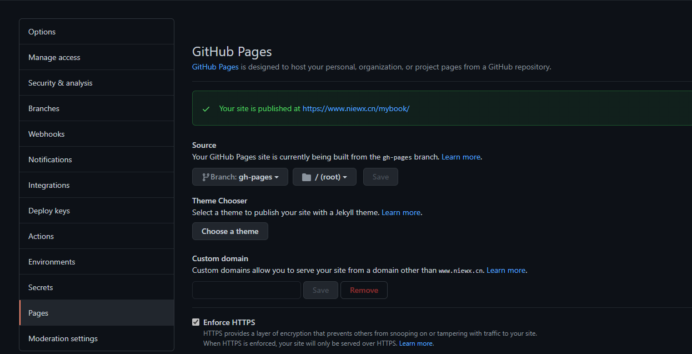
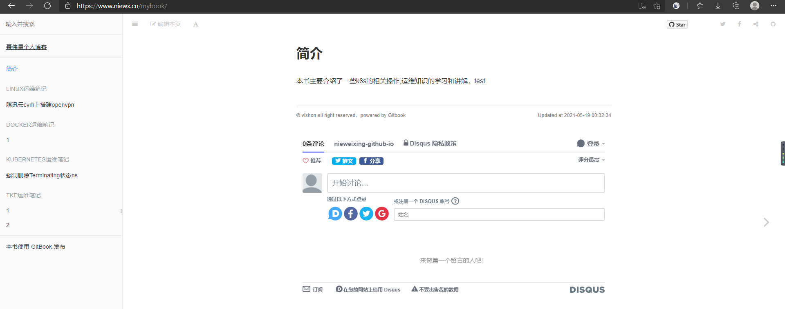

# github创建代码分支

这里我们创建了一个mybook的代码仓库用来存放gitbook

# 编译gitbook为静态文件

```
# cd gitbook
# mkdir content
```

然后将所有的md文件拷贝到content目录下，然后我们运行gitbook

```
gitbook serve ./content ./gh-pages
```

这样会自动创建 gh-pages 文件夹，文件夹中的内容，就是编译后的输出。

# 编写自动化脚本部署gitbook

自动化创建和更新 gh-pages
所以，我们采用一个 npm 包，来帮助我们完成上面的操作

```
cd gitbook/
npm i gh-pages
```

然后创建 gitbook/scripts/deploy-gh-pages.js

里面的内容是：

```
'use strict';

var ghpages = require('gh-pages');

main();

function main() {
    ghpages.publish('./gh-pages', console.error.bind(console));
}
```

上面的脚本的作用，就是把当前文件夹下的 gh-pages 文件夹中的所有内容，push 到本仓库的 gh-pages 分支。

然后在根目录下package.json文件添加几个npm脚本 deploy （ deploy 就是部署的意思），还有 build （意思是编译），还有 publish（意思是发布），如下：

```
{
  "name": "gitbook",
  "version": "1.0.0",
  "description": "",
  "main": "index.js",
  "scripts": {
    "start": "gitbook serve ./content ./gh-pages",
    "build": "gitbook build ./content ./gh-pages",
    "deploy": "node ./scripts/deploy-gh-pages.js",
    "publish": "npm run build&&npm run deploy"
  },
  "repository": {
    "type": "git",
    "url": "git+://github.com/nieweixing/mybook.git"
  },
  "keywords": [],
  "author": "",
  "license": "ISC",
  "bugs": {
    "url": "https://github.com/nieweixing/mybook/issues"
  },
  "homepage": "https://github.com/nieweixing/mybook#readme",
  "dependencies": {
    "cheerio": "^1.0.0-rc.9",
    "gh-pages": "^3.1.0",
    "gitbook-plugin-code": "^0.1.0",
    "gitbook-plugin-mygitalk": "^0.2.6",
    "gitbook-plugin-prism": "^2.4.0",
    "gitbook-plugin-prism-themes": "0.0.2",
    "prismjs": "^1.23.0"
  }
}

```

这样，以后我修改了书稿，只需运行

```
npm run publish
```

如果命令返回 undefined 字样，表示没有出现错误，部署成功。 就可以把最新的书稿 push 到远端仓库的 gh-pages 分支了。

# 配置github page

进入仓库，选择settings选项，找到page选项，配置下GitHub Pages，这里我之前配置了我自己的域名到github，所以我这边显示的自定义域名，而不是github.io这个

 

# 通过域名访问gitbook

浏览器输入<https://www.niewx.cn/mybook>，就可以查看gitbook了

 