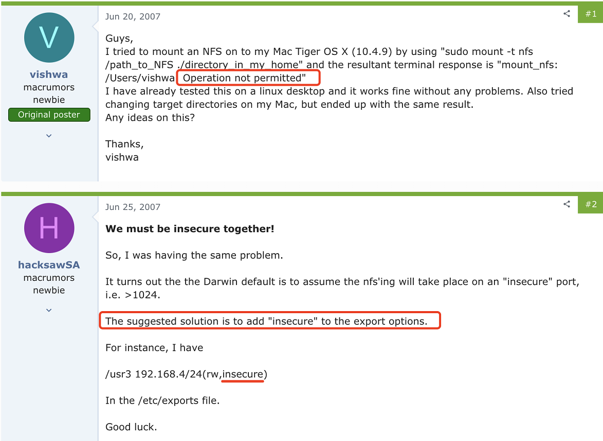

# pod挂载nfs数据卷报错权限不足

k8s中将pod的数据持久化，很多时候我们会用到nfs，最近我们遇到一个pod挂载nfs报错的问题，具体报错如下

```
MountVolume.SetUp failed for volume "xxxxxxx" : mount failed: exit status 32 Mounting command: mount Mounting arguments: -t nfs 10.0.0.10:/data/xxxx /var/lib/eklet-agent/pods/d43cc0d5-b294-4040-9b1b-f9672d8a54e5/volumes/kubernetes.io~nfs/xxxxx Output: Created symlink /run/systemd/system/remote-fs.target.wants/rpc-statd.service → /usr/lib/systemd/system/rpc-statd.service. mount.nfs: Operation not permitted       
```

从报错可以看出是权限不足，首先我们到nfs的服务端，检查下对应目录的权限，查看挂载目录的权限是/data/xxxx  *(rw)

nfs的权限是所有客户端都可以读写这个目录的，既然权限是足够，那么为什么会出现这个报错呢

通过google，发现有人对这个错误进行了定位和说明

 

由于pod出去的端口是高位端口，nfs默认是不允许高位端口去连接，所以需要加上insecure这个参数，这个参数的意思是

```
insecure：NFS通过1024以上的端口发送
```

最终的解决方案就是在nfs的/etc/exports文件将挂载的目录加上insecure参数

```
/data/xxxx  *(rw),insecure
```