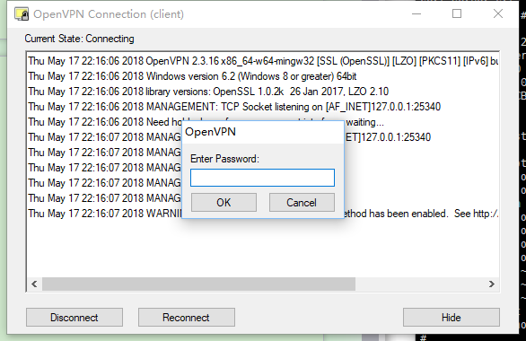
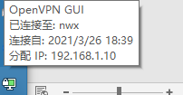
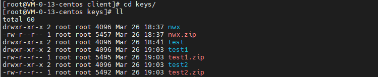

我们在使用共有云的时候，有时候会需要本地电脑访问到云上的vpc机器，但是云上vpc是网络隔离的，如果不加公网ip是无法直接本地访问vpc的，其实这里我们只需要在vpc内有一台机器可以访问公网，然后再这台集群上搭建openvpn，这样本地就可以通过openvpn去直接连接vpc内其他内网机器，不用每台机器都配置公网ip了，下面我们来说下如何在腾讯云的cvm上搭建openvpn。

# 网络规划

vpc网段：10.0.0.0/16

openvpn分配给客户端的网段：192.168.1.0/24

openvpn服务端ip：10.0.0.13(内网)，106.53.146.250(公网)


# 安装openvpn

```
# yum install openvpn
# wget  https://github.com/OpenVPN/easy-rsa/archive/master.zip
# unzip master.zip
# mv easy-rsa-master/ easy-rsa
# mkdir -p /etc/openvpn/
# cp -R easy-rsa/ /etc/openvpn/
# cd /etc/openvpn/
# mkdir client server
# ls
client  easy-rsa  server
```

# 配置vars文件

```
# cd /etc/openvpn/easy-rsa/easyrsa3
# cp vars.example vars
# vim vars
根据实际修改对应的配置
.......
set_var EASYRSA_REQ_COUNTRY     "CN"
set_var EASYRSA_REQ_PROVINCE    "SZ"
set_var EASYRSA_REQ_CITY        "GD"
set_var EASYRSA_REQ_ORG         "test"
set_var EASYRSA_REQ_EMAIL       "nwx_qdlg@163.com"
set_var EASYRSA_REQ_OU          "test"
.......
```

# 创建server端证书

## 初始化目录

```
[root@VM-0-13-centos easyrsa3]# ls
easyrsa  openssl-easyrsa.cnf  vars  vars.example  x509-types
[root@VM-0-13-centos easyrsa3]#  ./easyrsa init-pki

Note: using Easy-RSA configuration from: /etc/openvpn/easy-rsa/easyrsa3/vars

init-pki complete; you may now create a CA or requests.
Your newly created PKI dir is: /etc/openvpn/easy-rsa/easyrsa3/pki


[root@VM-0-13-centos easyrsa3]# ls
easyrsa  openssl-easyrsa.cnf  pki  vars  vars.example  x509-types
```

## 创建CA证书

```
[root@VM-0-13-centos easyrsa3]# ./easyrsa build-ca

Note: using Easy-RSA configuration from: /etc/openvpn/easy-rsa/easyrsa3/vars
Using SSL: openssl OpenSSL 1.0.2k-fips  26 Jan 2017

Enter New CA Key Passphrase:  #输入CA密码，记录下
Re-Enter New CA Key Passphrase: #确认密码
Generating RSA private key, 2048 bit long modulus
..................+++
............................................+++
e is 65537 (0x10001)
You are about to be asked to enter information that will be incorporated
into your certificate request.
What you are about to enter is what is called a Distinguished Name or a DN.
There are quite a few fields but you can leave some blank
For some fields there will be a default value,
If you enter '.', the field will be left blank.
-----
Common Name (eg: your user, host, or server name) [Easy-RSA CA]:server  # ca证书名称

CA creation complete and you may now import and sign cert requests.
Your new CA certificate file for publishing is at:
/etc/openvpn/easy-rsa/easyrsa3/pki/ca.crt
```

## 创建服务端证书

```
[root@VM-0-13-centos easyrsa3]# ./easyrsa gen-req server nopass

Note: using Easy-RSA configuration from: /etc/openvpn/easy-rsa/easyrsa3/vars
Using SSL: openssl OpenSSL 1.0.2k-fips  26 Jan 2017
Generating a 2048 bit RSA private key
....................+++
........................+++
writing new private key to '/etc/openvpn/easy-rsa/easyrsa3/pki/easy-rsa-32328.KOVmFR/tmp.kdL0Yx'
-----
You are about to be asked to enter information that will be incorporated
into your certificate request.
What you are about to enter is what is called a Distinguished Name or a DN.
There are quite a few fields but you can leave some blank
For some fields there will be a default value,
If you enter '.', the field will be left blank.
-----
Common Name (eg: your user, host, or server name) [server]:vpc-server #输入服务端名称

Keypair and certificate request completed. Your files are:
req: /etc/openvpn/easy-rsa/easyrsa3/pki/reqs/server.req
key: /etc/openvpn/easy-rsa/easyrsa3/pki/private/server.key
```

## 签约服务端证书

```
[root@VM-0-13-centos easyrsa3]# ./easyrsa sign server server

Note: using Easy-RSA configuration from: /etc/openvpn/easy-rsa/easyrsa3/vars
Using SSL: openssl OpenSSL 1.0.2k-fips  26 Jan 2017


You are about to sign the following certificate.
Please check over the details shown below for accuracy. Note that this request
has not been cryptographically verified. Please be sure it came from a trusted
source or that you have verified the request checksum with the sender.

Request subject, to be signed as a server certificate for 825 days:

subject=
    commonName                = vpc-server


Type the word 'yes' to continue, or any other input to abort.
  Confirm request details: yes  #输入yes
Using configuration from /etc/openvpn/easy-rsa/easyrsa3/pki/easy-rsa-345.HZwt53/tmp.7IIgHU
Enter pass phrase for /etc/openvpn/easy-rsa/easyrsa3/pki/private/ca.key:  #输入之前配置的CA密码
Check that the request matches the signature
Signature ok
The Subject's Distinguished Name is as follows
commonName            :ASN.1 12:'vpc-server'
Certificate is to be certified until Jun 29 09:02:24 2023 GMT (825 days)

Write out database with 1 new entries
Data Base Updated

Certificate created at: /etc/openvpn/easy-rsa/easyrsa3/pki/issued/server.crt
```

## 创建数据穿越密钥

```
[root@VM-0-13-centos easyrsa3]# ./easyrsa gen-dh

Note: using Easy-RSA configuration from: /etc/openvpn/easy-rsa/easyrsa3/vars
Using SSL: openssl OpenSSL 1.0.2k-fips  26 Jan 2017
Generating DH parameters, 2048 bit long safe prime, generator 2
This is going to take a long time
....................+..............................................................................................................................................................................................+..........................................................................................................................+..........................................+...................+...............................

DH parameters of size 2048 created at /etc/openvpn/easy-rsa/easyrsa3/pki/dh.pem
```

# 创建client证书

## 初始化目录

```
[root@VM-0-13-centos easyrsa3]# cd /etc/openvpn/client/
[root@VM-0-13-centos client]# cp -R /root/easy-rsa/easyrsa3/ .
[root@VM-0-13-centos client]# ll
drwxr-xr-x 3 root root 4096 Mar 26 17:07 easyrsa3
[root@VM-0-13-centos client]# cd easyrsa3/
[root@VM-0-13-centos easyrsa3]# ./easyrsa init-pki

init-pki complete; you may now create a CA or requests.
Your newly created PKI dir is: /etc/openvpn/client/easyrsa3/pki

[root@VM-0-13-centos easyrsa3]# ls
easyrsa  openssl-easyrsa.cnf  pki  vars.example  x509-types
```

## 创建客户端CA证书

```
[root@VM-0-13-centos easyrsa3]# ./easyrsa build-ca
Using SSL: openssl OpenSSL 1.0.2k-fips  26 Jan 2017

Enter New CA Key Passphrase: #输入ca密码
Re-Enter New CA Key Passphrase: #确认CA密码
Generating RSA private key, 2048 bit long modulus
.....................................+++
...........................................+++
e is 65537 (0x10001)
You are about to be asked to enter information that will be incorporated
into your certificate request.
What you are about to enter is what is called a Distinguished Name or a DN.
There are quite a few fields but you can leave some blank
For some fields there will be a default value,
If you enter '.', the field will be left blank.
-----
Common Name (eg: your user, host, or server name) [Easy-RSA CA]:client-ca #输入ca证书名称

CA creation complete and you may now import and sign cert requests.
Your new CA certificate file for publishing is at:
/etc/openvpn/client/easyrsa3/pki/ca.crt

```

## 创建客户端证书

```
[root@VM-0-13-centos easyrsa3]# ./easyrsa gen-req client
Using SSL: openssl OpenSSL 1.0.2k-fips  26 Jan 2017
Generating a 2048 bit RSA private key
........................................................+++
.............................................+++
writing new private key to '/etc/openvpn/client/easyrsa3/pki/easy-rsa-1789.jZxBCq/tmp.1l4buX'
Enter PEM pass phrase:  #输入客户端CA密码，也是将来登录VPN客户密码！
Verifying - Enter PEM pass phrase:
-----
You are about to be asked to enter information that will be incorporated
into your certificate request.
What you are about to enter is what is called a Distinguished Name or a DN.
There are quite a few fields but you can leave some blank
For some fields there will be a default value,
If you enter '.', the field will be left blank.
-----
Common Name (eg: your user, host, or server name) [client]:niewx #起名字

Keypair and certificate request completed. Your files are:
req: /etc/openvpn/client/easyrsa3/pki/reqs/client.req
key: /etc/openvpn/client/easyrsa3/pki/private/client.key
```

## 导入客户端证书

```
[root@VM-0-13-centos easyrsa3]# cd /etc/openvpn/easy-rsa/easyrsa3
[root@VM-0-13-centos easyrsa3]# ./easyrsa import-req /etc/openvpn/client/easyrsa3/pki/reqs/client.req client

Note: using Easy-RSA configuration from: /etc/openvpn/easy-rsa/easyrsa3/vars
Using SSL: openssl OpenSSL 1.0.2k-fips  26 Jan 2017

The request has been successfully imported with a short name of: client
You may now use this name to perform signing operations on this request.
```

## 签约客户端证书

```
[root@VM-0-13-centos easyrsa3]# cd /etc/openvpn/easy-rsa/easyrsa3
[root@VM-0-13-centos easyrsa3]# ./easyrsa sign client client
Using SSL: openssl OpenSSL 1.0.2k-fips  26 Jan 2017


You are about to sign the following certificate.
Please check over the details shown below for accuracy. Note that this request
has not been cryptographically verified. Please be sure it came from a trusted
source or that you have verified the request checksum with the sender.

Request subject, to be signed as a client certificate for 825 days:

subject=
    commonName                = niewx


Type the word 'yes' to continue, or any other input to abort.
  Confirm request details: yes # 输入yes
Using configuration from /etc/openvpn/client/easyrsa3/pki/easy-rsa-2777.2aZHdK/tmp.9RSG1Q
Enter pass phrase for /etc/openvpn/client/easyrsa3/pki/private/ca.key: #客户端ca密码
Check that the request matches the signature
Signature ok
The Subject's Distinguished Name is as follows
commonName            :ASN.1 12:'niewx'
Certificate is to be certified until Jun 29 09:16:55 2023 GMT (825 days)

Write out database with 1 new entries
Data Base Updated

Certificate created at: /etc/openvpn/easy-rsa/easyrsa3/pki/issued/client.crt

```

# openvpn服务端配置

## 拷贝服务端证书文件

```
[root@VM-0-13-centos pki]# cd /etc/openvpn/easy-rsa/easyrsa3/pki
[root@VM-0-13-centos pki]# cp ca.crt /etc/openvpn/server/
[root@VM-0-13-centos pki]# cp private/server.key /etc/openvpn/server/
[root@VM-0-13-centos pki]# cp issued/server.crt /etc/openvpn/server/
[root@VM-0-13-centos pki]# cp dh.pem /etc/openvpn/server/
```

## 拷贝客户端证书

```
[root@VM-0-13-centos pki]# cd /etc/openvpn/client/easyrsa3
[root@VM-0-13-centos pki]# cp /etc/openvpn/easy-rsa/easyrsa3/pki/ca.crt /etc/openvpn/client
[root@VM-0-13-centos private]# cp /etc/openvpn/client/easyrsa3/pki/private/client.key /etc/openvpn/client
[root@VM-0-13-centos issued]# cp /etc/openvpn/easy-rsa/easyrsa3/pki/issued/client.crt /etc/openvpn/client
[root@VM-0-13-centos issued]# cd /etc/openvpn/client/
[root@VM-0-13-centos client]# ls
ca.crt  client.crt  client.key  easyrsa3
[root@VM-0-13-centos client]# cd /etc/openvpn/server/
[root@VM-0-13-centos server]# ls
ca.crt  dh.pem  server.crt  server.key
```

## 配置server.conf

```
[root@VM-0-13-centos openvpn]# cd /etc/openvpn
[root@VM-0-13-centos openvpn]# vim server.conf

local 0.0.0.0
port 55555
proto tcp
dev tun
ca /etc/openvpn/server/ca.crt
cert /etc/openvpn/server/server.crt
key /etc/openvpn/server/server.key  # This file should be kept secret
dh /etc/openvpn/server/dh.pem
server 192.168.1.0 255.255.255.0
ifconfig-pool-persist ipp.txt
keepalive 10 120
persist-key
persist-tun
status openvpn-status.log
verb 3
comp-lzo
push "route 10.0.0.0 255.0.0.0"
client-to-client
log /var/log/openvpn.log
```

## 配置转发参数和iptables规则

```
[root@VM-0-13-centos openvpn]# sed -i '/net.ipv4.ip_forward/ s/\(.*= \).*/\11/' /etc/sysctl.conf
[root@VM-0-13-centos client]# iptables -t nat -A POSTROUTING -s 192.168.1.0/24 -o eth0 -j MASQUERADE
[root@VM-0-13-centos client]# iptables -nL -t nat
Chain PREROUTING (policy ACCEPT)
target     prot opt source               destination

Chain INPUT (policy ACCEPT)
target     prot opt source               destination

Chain OUTPUT (policy ACCEPT)
target     prot opt source               destination

Chain POSTROUTING (policy ACCEPT)
target     prot opt source               destination
MASQUERADE  all  --  192.168.1.0/24       0.0.0.0/0
```

# 启动oepnven服务端

```
[root@VM-0-13-centos client]# openvpn /etc/openvpn/server.conf &
[1] 5785
[root@VM-0-13-centos client]# ps -ef | grep openvpn
root      5785 26254  0 17:37 pts/0    00:00:00 openvpn /etc/openvpn/server.conf
```

# 本地机器安装openvpn客户端

可以到<https://openvpn.net/community-downloads/>下载对应系统客户端安装包

# 拷贝客户端证书到本地目录

主要/etc/openvpn/client目录下拷贝ca.crt，client.crt，client.key，然后配置下文件client.ovpn，内容如下

```
client 
dev tun 
proto tcp 
remote 106.53.146.250  55555
resolv-retry infinite 
nobind 
persist-key 
persist-tun 
ca ca.crt 
cert client1.crt
key client1.key 
comp-lzo 
verb 3 
```

# 运行vpn连接服务端

 

 

连接成功后，我们直接内网访问下服务，发现可以直接内网ip访问到prometheus的UI界面，这里说明我们本地电脑成功连接了vpc

 

# 自动生成客户端的脚本

```
[root@VM-0-13-centos client]# cd /etc/openvpn/client
[root@VM-0-13-centos client]# cat auto-generate-client.sh
# ! /bin/bash

set -e

OVPN_USER_KEYS_DIR=/etc/openvpn/client/keys
EASY_RSA_VERSION=easyrsa3
EASY_RSA_DIR=/etc/openvpn/easy-rsa
PKI_DIR=$EASY_RSA_DIR/$EASY_RSA_VERSION/pki

for user in "$@"
do
  if [ -d "$OVPN_USER_KEYS_DIR/$user" ]; then
    rm -rf $OVPN_USER_KEYS_DIR/$user
    rm -rf  $PKI_DIR/reqs/$user.req
    rm -rf  $PKI_DIR/private/$user.key
    rm -rf  $PKI_DIR/issued/$user.crt
    sed -i '/'"$user"'/d' $PKI_DIR/index.txt  #通过index.txt文件查看到证书的情况，首字母为R的证书就是已经被吊销的证书。
    exit 0
  fi
  cd $EASY_RSA_DIR/$EASY_RSA_VERSION
  # 生成客户端 ssl 证书文件
  ./easyrsa build-client-full $user nopass
  # 整理下生成的文件
  mkdir -p  $OVPN_USER_KEYS_DIR/$user
  cp $PKI_DIR/ca.crt $OVPN_USER_KEYS_DIR/$user/   # CA 根证书
  cp $PKI_DIR/issued/$user.crt $OVPN_USER_KEYS_DIR/$user/   # 客户端证书
  cp $PKI_DIR/private/$user.key $OVPN_USER_KEYS_DIR/$user/  # 客户端证书密钥
  cp /etc/openvpn/client/sample.ovpn $OVPN_USER_KEYS_DIR/$user/$user.ovpn # 客户端配置文件
  sed -i 's/admin/'"$user"'/g' $OVPN_USER_KEYS_DIR/$user/$user.ovpn
  cd $OVPN_USER_KEYS_DIR
  zip -r $user.zip $user
done
exit 0
```

脚本会自动生成客户端证书，执行方式如下，如果需要生成多个用户则在参数加上就行

```
# sh  auto-generate-client.sh test1 test2 .....
```

 

将对应的zip包拷贝给用户，然后再openvpn中指定对应的ovpn文件进行配置下连接即可

