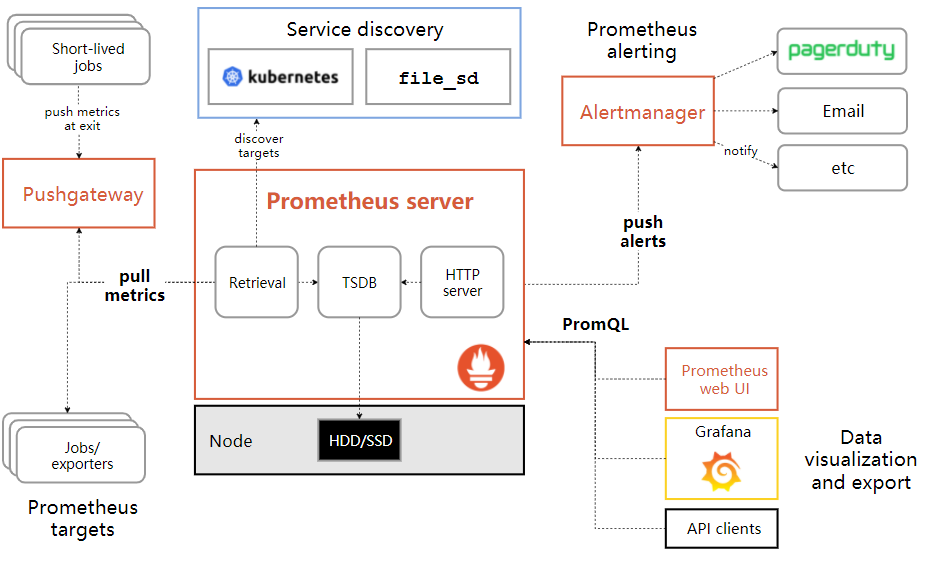

# prometheus简介

Prometheus是一个开源监控系统，它前身是SoundCloud的警告工具包。从2012年开始，许多公司和组织开始使用Prometheus。该项目的开发人员和用户社区非常活跃，越来越多的开发人员和用户参与到该项目中。目前它是一个独立的开源项目，且不依赖与任何公司。 为了强调这点和明确该项目治理结构，Prometheus在2016年继Kurberntes之后，加入了Cloud Native Computing Foundation。

**特征**

Prometheus的主要特征有：

* 多维度数据模型
* 灵活的查询语言
* 不依赖分布式存储，单个服务器节点是自主的
* 以HTTP方式，通过pull模型拉去时间序列数据
* 也通过中间网关支持push模型
* 通过服务发现或者静态配置，来发现目标服务对象
* 支持多种多样的图表和界面展示，grafana也支持它

**组件**

Prometheus生态包括了很多组件，它们中的一些是可选的：

* 主服务Prometheus Server负责抓取和存储时间序列数据
* 客户库负责检测应用程序代码
* 支持短生命周期的PUSH网关
* 基于Rails/SQL仪表盘构建器的GUI
* 多种导出工具，可以支持Prometheus存储数据转化为HAProxy、StatsD、Graphite等工具所需要的数据存储格式
* 警告管理器
* 命令行查询工具
* 其他各种支撑工具
* 多数Prometheus组件是Go语言写的，这使得这些组件很容易编译和部署。

**架构**

下面这张图说明了Prometheus的整体架构，以及生态中的一些组件作用:

 


Prometheus服务，可以直接通过目标拉取数据，或者间接地通过中间网关拉取数据。它在本地存储抓取的所有数据，并通过一定规则进行清理和整理数据，并把得到的结果存储到新的时间序列中，PromQL和其他API可视化地展示收集的数据

**适用场景**

Prometheus在记录纯数字时间序列方面表现非常好。它既适用于面向服务器等硬件指标的监控，也适用于高动态的面向服务架构的监控。对于现在流行的微服务，Prometheus的多维度数据收集和数据筛选查询语言也是非常的强大。

Prometheus是为服务的可靠性而设计的，当服务出现故障时，它可以使你快速定位和诊断问题。它的搭建过程对硬件和服务没有很强的依赖关系。

**不适用场景**

Prometheus，它的价值在于可靠性，甚至在很恶劣的环境下，你都可以随时访问它和查看系统服务各种指标的统计信息。 如果你对统计数据需要100%的精确，它并不适用，例如：它不适用于实时计费系统

# 基本概念

* job: Prometheus的采集任务由配置文件中一个个的Job组成，一个Job里包含该Job下的所有监控目标的公共配置，比如使用哪种服务发现去获取监控目标，比如抓取时使用的证书配置，请求参数配置等等。
* target: 一个监控目标就是一个target，一个job通过服务发现会得到多个需要监控的target，其包含一些label用于描述target的一些属性。
* relabel_configs: 每个job都可以配置一个或多个relabel_config，relabel_config会对target的label集合进行处理，可以根据label过滤一些target或者修改，增加，删除一些label。relabel_config过程发生在target开始进行采集之前,针对的是通过服务发现得到的label集合。
* metrics_relabel_configs：每个job还可以配置一个或者多个metrics_relabel_config，其配置方式和relabel_configs一模一样，但是其用于处理的是从target采集到的数据中的label。也就是发送在采集之后。
* series(序列)：一个series就是指标名+label集合。
* head series：Prometheus会将近2小时的series缓存在内测中，称为head series。

# 指标类型

Prometheus定义了4中不同的指标类型(metric type)：Counter（计数器）、Gauge（仪表盘）、Histogram（直方图）、Summary（摘要）

* Counter: 一种累加的metric，如请求的个数，结束的任务数，出现的错误数等

* Gauge: 常规的metric,如温度，可任意加减。其为瞬时的，与时间没有关系的，可以任意变化的数据。

* Histogram: 柱状图，用于观察结果采样，分组及统计，如：请求持续时间，响应大小。其主要用于表示一段时间内对数据的采样，并能够对其指定区间及总数进行统计。根据统计区间计算

* Summary: 类似Histogram，用于表示一段时间内数据采样结果，其直接存储quantile数据，而不是根据统计区间计算出来的。不需要计算，直接存储结果


# promql

PromQL (Prometheus Query Language) 是 Prometheus 自己开发的数据查询 DSL 语言。

## 结果类型

查询结果类型：

* 瞬时数据 (Instant vector): 包含一组时序，每个时序只有一个点，例如：http_requests_total

* 区间数据 (Range vector): 包含一组时序，每个时序有多个点，例如：http_requests_total[5m]

* 纯量数据 (Scalar): 纯量只有一个数字，没有时序，例如：count(http_requests_total)

## 匹配模式

PromQL支持使用=和!=两种完全匹配模式：
* 通过使用label=value可以选择那些标签满足表达式定义的时间序列；
* 反之使用label!=value则可以根据标签匹配排除时间序列；

除了使用完全匹配的方式对时间序列进行过滤以外，PromQL还可以支持使用正则表达式作为匹配条件，多个表达式之间使用|进行分离：
* 使用label=~regx表示选择那些标签符合正则表达式定义的时间序列；
* 反之使用label!~regx进行排除

## 时间位移

如果我们想查询，5分钟前的瞬时样本数据，或昨天一天的区间内的样本数据呢? 这个时候我们就可以使用位移操作，位移操作的关键字为offset。
可以使用offset时间位移操作：

```
http_request_total{} offset 5m
http_request_total{}[1d] offset 1d
```

## 数学运算符

PromQL支持的所有数学运算符如下所示：

* \+ (加法)
* \- (减法)
* \* (乘法)
* / (除法)
* % (求余)
* ^ (幂运算)

```
node_memory_free_bytes_total / (1024 * 1024)
```

## 布尔运算符

Prometheus支持以下布尔运算符如下：
* == (相等)
* != (不相等)
* \> (大于)
* < (小于)
* \>= (大于等于)
* <= (小于等于)

```
(node_memory_bytes_total - node_memory_free_bytes_total) / node_memory_bytes_total > 0.95
```

布尔运算符的默认行为是对时序数据进行过滤。而在其它的情况下我们可能需要的是真正的布尔结果。例如，只需要知道当前模块的HTTP请求量是否>=1000，如果大于等于1000则返回1（true）否则返回0（false）。这时可以使用bool修饰符改变布尔运算的默认行为

```
2 == bool 2 # 结果为1
```

## 集合运算符

使用瞬时向量表达式能够获取到一个包含多个时间序列的集合，我们称为瞬时向量。 通过集合运算，可以在两个瞬时向量与瞬时向量之间进行相应的集合操作。目前，Prometheus支持以下集合运算符：

* and (并且)
* or (或者)
* unless (排除)

vector1 and vector2 会产生一个由vector1的元素组成的新的向量。该向量包含vector1中完全匹配vector2中的元素组成。

vector1 or vector2 会产生一个新的向量，该向量包含vector1中所有的样本数据，以及vector2中没有与vector1匹配到的样本数据。

vector1 unless vector2 会产生一个新的向量，新向量中的元素由vector1中没有与vector2匹配的元素组成。

## 聚合操作符

* sum (在维度上求和)
* max (在维度上求最大值)
* min (在维度上求最小值)
* avg (在维度上求平均值)
* stddev (求标准差)
* stdvar (求方差)
* count (统计向量元素的个数)
* count_values (统计相同数据值的元素数量)
* bottomk (样本值第k个最小值)
* topk (样本值第k个最大值)
* quantile (统计分位数)

这些操作符被用于聚合所有标签维度，或者通过without或者by子句来保留不同的维度。

```
<aggr-op>([parameter,] <vector expr>) [without | by (<label list>)] [keep_common]
```

parameter只能用于count_values, quantile, topk和bottomk。without移除结果向量中的标签集合，其他标签被保留输出。by关键字的作用正好相反，即使它们的标签值在向量的所有元素之间。keep_common子句允许保留额外的标签（在元素之间相同，但不在by子句中的标签）

count_values对每个唯一的样本值输出一个时间序列。每个时间序列都附加一个标签。这个标签的名字有聚合参数指定，同时这个标签值是唯一的样本值。每一个时间序列值是结果样本值出现的次数。

topk和bottomk与其他输入样本子集聚合不同，返回的结果中包括原始标签。by和without仅仅用在输入向量的桶中

如果度量指标名称http_requests_total包含由group, application, instance的标签组成的时间序列数据，我们可以通过以下方式计算去除instance标签的http请求总数：

```
sum(http_requests_total) without (instance)
```

如果我们对所有应用程序的http请求总数，我们可以简单地写下：

```
sum(http_requests_total)
```

统计每个编译版本的二进制文件数量，我们可以如下写：

```
count_values("version", build_version)
```

通过所有实例，获取http请求第5个最大值，我们可以简单地写下：

```
topk(5, http_requests_total)
```

## 函数

函数一般使用较少，具体参考官方文档<https://prometheus.io/docs/prometheus/latest/querying/functions/>

## 向量匹配

向量之间的匹配是指右边向量中的每一个元素，在左边向量中也存在。这里有两种基本匹配行为特征：

一对一，找到这个操作符的两边向量元素的相同元素。默认情况下，操作符的格式是vector1 [operate] vector2。如果它们有相同的标签和值，则表示相匹配。ingoring关键字是指，向量匹配时，可以忽略指定标签。on关键字是指，在指定标签上进行匹配。格式如下所示：

```
[vector expr] [bin-op] ignoring([label list]) [vector expr]

[vector expr] [bin-op] on([lable list]) [vector expr]

例如样本数据：

 method_code:http_errors:rate5m{method="get", code="500"} 24
 method_code:http_errors:rate5m{method="get", code="404"} 30
 method_code:http_errors:rate5m{method="put", code="501"} 3
 method_code:http_errors:rate5m{method="post", code="404"} 21

 method:http_requests:rate5m{method="get"} 600
 method:http_requests:rate5m{method="delete"} 34
 method:http_requests:rate5m{method="post"} 120

查询例子：

method_code:http_errors:rate5m{code="500"} / ignoring(code) method:http_requests:rate5m

```

两个向量之间的除法操作运算的向量结果是，每一个向量样本http请求方法标签值是500，且在过去5分钟的运算值。如果没有忽略code="500"的标签，这里不能匹配到向量样本数据。两个向量的请求方法是put和delete的样本数据不会出现在结果列表中


```
{method="get"} 0.04 // 24 / 600

{method="post"} 0.05 // 6 / 120
```


多对一和一对多的匹配，是指向量元素中的一个样本数据匹配标签到了多个样本数据标签。这里必须直接指定两个修饰符group_left或者group_right， 左或者右决定了哪边的向量具有较高的子集。

```
<vector expr> <bin-op> ignoring(<label list>) group_left(<label list>) <vector expr>

<vector expr> <bin-op> ignoring(<label list>) group_right(<label list>) <vector expr>

<vector expr> <bin-op> on(<label list>) group_left(<label list>) <vector expr>

<vector expr> <bin-op> on(<label list>) group_right(<label list>) <vector expr>
```

这个group带标签的修饰符标签列表包含了“一对多”中的“一”一侧的额外标签。对于on标签只能是这些列表中的一个。结果向量中的每一个时间序列数据都是唯一的。

group修饰符只能被用在比较操作符和算术运算符。

```
method_code:http_errors:rate5m / ignoring(code) group_left method:http_requests:rate5m

在这个例子中，左向量的标签数量多于左边向量的标签数量，所以我们使用group_left。右边向量的时间序列元素匹配左边的所有相同method标签:

{method="get", code="500"} 0.04 // 24 /600

{method="get", code="404"} 0.05 // 30 /600

{method="post", code="500"} 0.05 // 6 /600

{method="post", code="404"} 0.175 // 21 /600
```

多对一和一对多匹配应该更多地被谨慎使用。经常使用ignoring(\<labels\>)输出想要的结果。


# api访问prometheus

k8s集群内我们可以通过kubectl get --raw / 获取根下的接口，然后层层下探，直到找到需要的监控数据。

```
pod：kubectl get --raw /api/v1/nodes/10.168.1.4/proxy/metrics/cadvisor
node: kubectl get --raw /api/v1/nodes/10.168.1.4:9100/proxy/metrics
kubelet: kubectl get --raw /api/v1/nodes/10.168.1.4:10250/proxy/metrics
```

用curl请求prometheus的地址来进行查询，查询所有up的job

```
curl http://10.0.0.234:9090/api/v1/query?query=up
```

http api来查询prometheus可以参考官方文档<https://prometheus.io/docs/prometheus/latest/querying/api/>