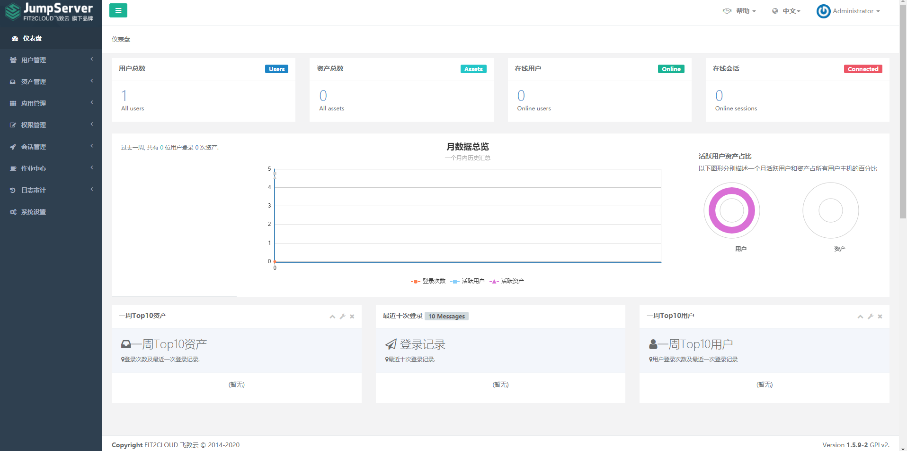

本篇文章主要讲述如何在tke集群上部署Jumpserver跳板机，本次采用的1.18.4版本的集群。

# 部署mysql数据库

这里我们通过helm部署mysql数据库

```
helm install nwx-mysql stable/mysql --namespace mysql
```

这里我们需要获取下mysql的root用户数据库密码

```
kubectl get secret nwx-mysql -n mysql -o jsonpath={.data.mysql-root-password} |base64 -d
```

注意这里还需要给Jumpserver创建好数据库，登录mysql执行下面这条sql

```
create database jumpserver default charset 'utf8';
```


# 部署redis数据库

redis数据库我们也通过helm部署下，也部署在mysql命名空间

```
helm install nwx-redis bitnami/redis --namespace mysql
```

然后获取下redis数据库的密码

```
kubectl get secret nwx-redis -n mysql -o jsonpath={.data.redis-password} |base64 -d
```


# 部署Jumpserver

这里我们先在控制台创建一个jumpserver-datadir的pvc，使用了20G的云硬盘

```
apiVersion: v1
kind: PersistentVolumeClaim
metadata:
  name: jumpserver-datadir
  namespace: jumpserver
  annotations:
    volume.beta.kubernetes.io/storage-provisioner: cloud.tencent.com/qcloud-cbs
spec:
  accessModes:
  - ReadWriteOnce
  resources:
    requests:
      storage: 20Gi
```

然后生成下jumpserver需要到的SECRET_KEY和BOOTSTRAP_TOKEN

```
# SECRET_KEY 生成方式： 
cat /dev/urandom | tr -dc A-Za-z0-9 | head -c 50

# BOOTSTRAP_TOKEN生成方式：
cat /dev/urandom | tr -dc A-Za-z0-9 | head -c 16

```

```
apiVersion: apps/v1
kind: Deployment
metadata:
  name: jumpserver
  namespace: jumpserver
  labels:
    app.kubernetes.io/instance: jumpserver
    app.kubernetes.io/name: jumpserver
spec:
    replicas: 1
    strategy:
      rollingUpdate:
        maxSurge: 1
        maxUnavailable: 0
      type: RollingUpdate
    selector:
      matchLabels:
        app.kubernetes.io/instance: jumpserver
        app.kubernetes.io/name: jumpserver
    template:
      metadata:
        labels:
          app.kubernetes.io/instance: jumpserver
          app.kubernetes.io/name: jumpserver
      spec:
        containers:
        - env:
          - name: SECRET_KEY
            value: "j9fKwmVV39DzqZ27tWnMffpLzP6TsvQkHCaxJRcKn"
          - name: BOOTSTRAP_TOKEN
            value: "nWZStpQ1UTO"
          - name: DB_ENGINE
            value: "mysql"
          - name: DB_HOST
            value: "nwx-mysql.mysql"
          - name: DB_PORT
            value: "3306"
          - name: DB_USER
            value: "root"
          - name: "DB_PASSWORD"
            value: "2hblVjr"
          - name: DB_NAME
            value: "jumpserver"
          - name: REDIS_HOST
            value: "nwx-redis-master.mysql"
          - name: REDIS_PORT
            value: "6379"
          - name: REDIS_PASSWORD
            value: "twsnty9"
          image: jumpserver/jms_all:1.5.9
          imagePullPolicy: IfNotPresent
          name: jumpserver
          ports:
          - containerPort: 80
            name: http
            protocol: TCP
          - containerPort: 2222
            name: ssh
            protocol: TCP
          volumeMounts:
          - mountPath: /opt/jumpserver/data/media
            name: datadir
        volumes:
        - name: datadir
          persistentVolumeClaim:
            claimName: jumpserver-datadir

---
apiVersion: v1
kind: Service
metadata:
  name: jumpserver
  namespace: jumpserver
  labels:
    app.kubernetes.io/instance: jumpserver
    app.kubernetes.io/name: jumpserver
spec:
  ports:
  - name: http
    port: 80
    targetPort: 80
    protocol: TCP
  - name: ssh
    port: 2222
    targetPort: 2222
    protocol: TCP
  selector:
    app.kubernetes.io/instance: jumpserver
    app.kubernetes.io/name: jumpserver

```

# 创建ingress提供访问域名


```
apiVersion: networking.k8s.io/v1beta1
kind: Ingress
metadata:
  annotations:
    kubernetes.io/ingress.class: ingress
  name: jumpserver-ingress
  namespace: jumpserver
spec:
  rules:
  - host: jumpserver.tke.niewx.cn
    http:
      paths:
      - backend:
          serviceName: jumpserver
          servicePort: 80
        path: /
```

然后再控制台输入访问域名 ，jumpserver默认的登录密码是admin/admin

 