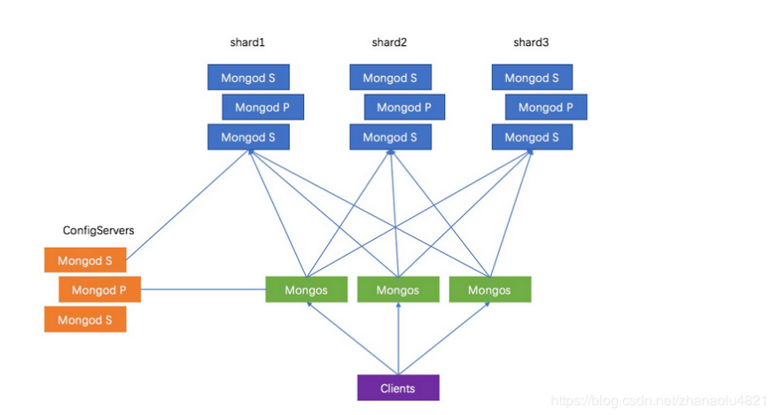
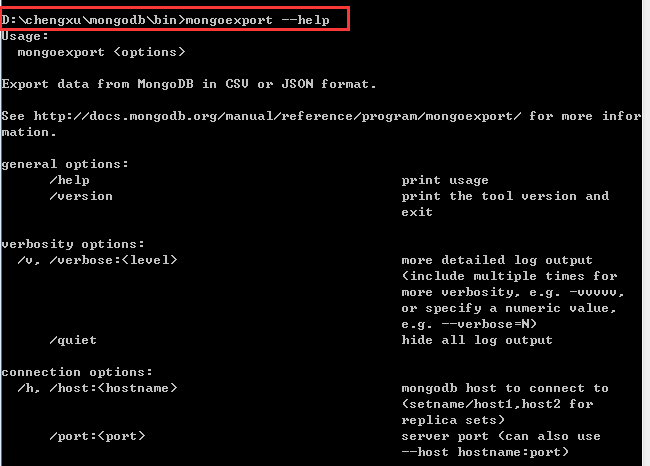
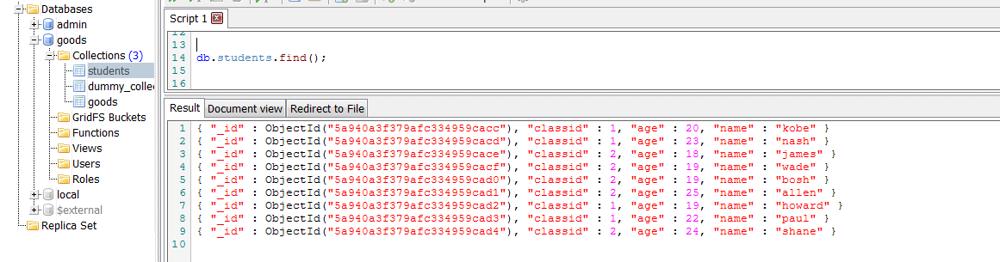
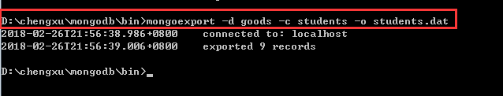
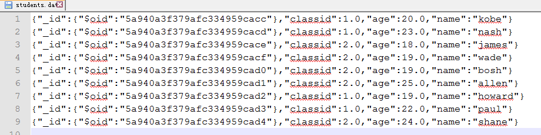
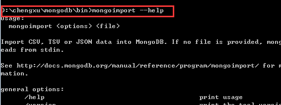
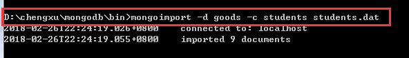

# Mongdb运维知识

## mongodb集群的搭建

### 系统环境

Centos7.5、MongoDB4.0.2、关闭防火墙。

|Ip	|路由服务端口|	配置服务端口|	分片1端口	|分片2端口|	分片3端口|
|  ----  | ----  |  ----  | ----  |  ----  | ----  |
|192.168.30.30|	27017	|27018	|27001	|27002|	27003|
|192.168.30.31|	27017|	27018|	27001|	27002|	27003|
|192.168.30.32	|27017	|27018|	27001|	27002|	27003|
 
 

三台机器的配置服务(27018)形成复制集，分片1、2、3也在各机器都部署一个实例，它们之间形成复制集，客户端直接连接3个路由服务与之交互，配置服务和分片服务对客户端是透明的。
服务器的安装及配置(3台服务器执行相同操作)


### 下载解压MongoDB

到MongoDB官网下载：https://fastdl.mongodb.org/linux/mongodb-linux-x86_64-4.0.6.tgz

解压到/home/mongodb，设置环境变量:

```
echo 'export PATH=$PATH:/home/mongodb/bin'  >> /etc/profile
保存后执行：
source  /etc/profile
```

### 创建路由、配置、分片等的相关目录与文件

```
启动配置文件存放的文件夹：mkdir -p /home/mongodb/conf     
配置服务数据存放目录：mkdir -p /home/mongodb/data/config     
分片1服务数据存放目录：mkdir -p /home/mongodb/data/shard1     
分片2服务数据存放目录：mkdir -p /home/mongodb/data/shard2     
分片3服务数据存放目录：mkdir -p /home/mongodb/data/shard3     
配置服务日志存放文件：touch  /home/mongodb/log/config.log     
路由服务日志存放文件：touch  /home/mongodb/log/mongos.log     
分片1服务日志存放文件：touch  /home/mongodb/log/shard1.log     
分片2服务日志存放文件：touch  /home/mongodb/log/shard2.log     
分片3服务日志存放文件：touch  /home/mongodb/log/shard3.log

mkdir -p /home/mongodb/conf
mkdir -p /home/mongodb/data/config
mkdir -p /home/mongodb/data/shard1
mkdir -p /home/mongodb/data/shard2
mkdir -p /home/mongodb/data/shard3
mkdir -p /home/mongodb/log
touch  /home/mongodb/log/config.log
touch  /home/mongodb/log/mongos.log
touch  /home/mongodb/log/shard1.log
touch  /home/mongodb/log/shard2.log
touch  /home/mongodb/log/shard3.log
```

配置服务器部署(3台服务器执行相同操作)

### 在/home/mongodb/conf目录创建config.conf

```
 [root@master conf]# cat config.conf
dbpath=/home/mongodb/data/config
logpath=/home/mongodb/log/config.log
port=27018
logappend=true
fork=true
maxConns=5000
#复制集名称
replSet=configs
#置参数为true
configsvr=true
#允许任意机器连接
bind_ip=0.0.0.0
```

### 配置复制集

```
scp config.conf root@192.168.30.31:/home/mongodb/conf
scp config.conf root@192.168.30.32:/home/mongodb/conf
```

分别启动三台服务器的配置服务：

```
mongod -f /home/mongodb/conf/config.conf
```

### 连接mongo,只需在任意一台机器执行即可：

```
mongo --host 10.211.55.3 --port 27018
```

切换数据库：

```
use admin
```

初始化复制集：

```
rs.initiate({_id:"configs",members:[{_id:0,host:"192.168.30.30:27018"},{_id:1,host:"192.168.30.31:27018"}, {_id:2,host:"192.168.30.32:27018"}]})
```

其中_id:"configs"的configs是上面config.conf配置文件里的复制集名称，把三台服务器的配置服务组成复制集。

查看状态：

```
rs.status()
```

等几十秒左右，执行上面的命令查看状态，三台机器的配置服务就已形成复制集，其中1台为PRIMARY，其他2台为SECONDARY。

### 分片服务部署(3台服务器执行相同操作)

在/home/mongodb/conf目录创建shard1.conf、shard2.conf、shard3.conf，内容如下：

```     
[root@master conf]# cat shard1.conf
dbpath=/home/mongodb/data/shard1 #其他2个分片对应修改为shard2、shard3文件夹
logpath=/home/mongodb/log/shard1.log #其他2个分片对应修改为shard2.log、shard3.log
port=27001 #其他2个分片对应修改为27002、27003
logappend=true
fork=true
maxConns=5000
storageEngine=mmapv1
shardsvr=true
replSet=shard1 #其他2个分片对应修改为shard2、shard3
bind_ip=0.0.0.0
```
端口分别是27001、27002、27003，分别对应shard1.conf、shard2.conf、shard3.conf。

还有数据存放目录、日志文件这几个地方都需要对应修改。

在3台机器的相同端口形成一个分片的复制集，由于3台机器都需要这3个文件，所以根据这9个配置文件分别启动分片服务：

```
scp shard* root@192.168.30.30:/home/mongodb/conf
scp shard* root@192.168.30.31:/home/mongodb/conf
scp shard* root@192.168.30.32:/home/mongodb/conf
mongod --smallfiles -f /home/mongodb/conf/shard1.conf
mongod --smallfiles -f /home/mongodb/conf/shard2.conf
mongod --smallfiles -f /home/mongodb/conf/shard3.conf2
```

将分片配置为复制集连接mongo，只需在任意一台机器执行即可：

```
mongo --host 192.168.30.30 --port 27001 //这里以shard1为例，其他两个分片则再需对应连接到27002、27003的端口进行操作即可
```

切换数据库：

```
use admin
```

初始化复制集：

```
rs.initiate({_id:"shard1",members:[{_id:0,host:"192.168.30.30:27001"},{_id:1,host:"192.168.30.31:27001"},{_id:2,host:"192.168.30.32:27001"}]})
```

以上是基于分片1来操作，同理，其他2个分片也要连到各自的端口来执行一遍上述的操作，让3个分片各自形成1主2从的复制集，注意端口及仲裁节点的问题即可，操作完成后3个分片都启动完成，并完成复制集模式。

```
mongo --host 192.168.30.30 --port 27002
use admin
rs.initiate({_id:"shard2",members:[{_id:0,host:"192.168.30.30:27002"},{_id:1,host:"192.168.30.31:27002"},{_id:2,host:"192.168.30.32:27002"}]})

mongo --host 192.168.30.30 --port 27003
use admin
rs.initiate({_id:"shard3",members:[{_id:0,host:"192.168.30.30:27003"},{_id:1,host:"192.168.30.31:27003"},{_id:2,host:"192.168.30.32:27003"}]})
```

### 路由服务部署(3台服务器执行相同操作)

#### 创建mongos.conf

在/home/mongodb/conf目录创建mongos.conf，内容如下：  

```
 [root@master conf]# cat mongos.conf
logpath=/home/mongodb/log/mongos.log
logappend = true
port = 27017
fork = true
configdb = configs/192.168.30.30:27018,192.168.30.31:27018,192.168.30.32:27018
maxConns=20000
bind_ip=0.0.0.0

scp mongos.conf root@192.168.30.31:/home/mongodb/conf
scp mongos.conf root@192.168.30.32:/home/mongodb/conf
```

#### 启动mongos

分别在三台服务器启动：

```
mongos -f /home/mongodb/conf/mongos.conf
```

#### 启动分片功能

连接mongo：

```
mongo --host 10.211.55.3 --port 27017
```

#### 切换数据库：

```
use admin

添加分片，只需在一台机器执行即可：        
sh.addShard("shard1/192.168.30:27001,192.168.30.31:27001,192.168.30.32:27001")
sh.addShard("shard2/192.168.30:27001,192.168.30.31:27001,192.168.30.32:27001")
sh.addShard("shard3/192.168.30:27001,192.168.30.31:27001,192.168.30.32:27001")    
```

#### 查看集群状态：

```
sh.status()
```

#### 实现分片功能
设置分片chunk大小 

```
use config     
db.setting.save({"_id":"chunksize","value":1}) # 设置块大小为1M是方便实验，不然需要插入海量数据
```

#### 模拟写入数据   

```
use calon     
for(i=1;i<=50000;i++){db.user.insert({"id":i,"name":"jack"+i})} #模拟往calon数据库的user表写入5万数据
启用数据库分片
sh.enableSharding("calon")
```
#### 创建索引对表进行分片 

```
db.user.createIndex({"id":1}) # 以"id"作为索引     
sh.shardCollection(calon.user",{"id":1}) # 根据"id"对user表进行分片     
sh.status() # 查看分片情况
```

到此，MongoDB分布式集群就搭建完毕。

## docker中运行mongodb

### 镜像下载

```
执行 docker search mongo 命令和docker pull mongo
```

### 运行mongo镜像

```
docker run  \
--name mongodb_server \
-p 27017:27017  \
-v /mysoft/mongodb/configdb:/data/configdb/ \
-v /mysoft/mongodb/db/:/data/db/ \
-d mongo --auth
```

### 采用admin用户进入mongodb

```
docker exec -it a7e5d4e4ca69 mongo admin
```

### 创建admin管理员账户

```
db.createUser({ user: 'admin', pwd: 'admin123456', roles: [ { role: "userAdminAnyDatabase", db: "admin" } ] });
```

### 以 admin 用户身份进入mongo 

```
docker exec -it a7e5d4e4ca69 mongo admin
```

### 对 admin 用户 进行身份认证

```
db.auth("admin","admin123456");
```
### 创建 用户、密码和数据库

```
db.createUser({ user: 'swen', pwd: 'swen123456', roles: [ { role: "readWrite", db: "app" } ] });
```

### 以 admin 用户身份进入mongo 

```
docker exec -it a7e5d4e4ca69 mongo admin
```

### 对 swen 进行身份认证

```
db.auth("swen","swen123456");
```

### 切换数据库

```
use app
```

### 添加数据

```
db.test.save({name:"zhangsan"});
```
### 查看数据库

```
show dbs
```

### 数据库集合（类似于表）操作命令

```
show collections
db.createCollection("mycol", { capped : true, autoIndexId : true, size : 6142800, max : 10000 } )
db.mycol2.insert({"name" : "菜鸟教程"})
db.mycol2.drop()
```

### 数据库文档（类似于一行一行数据）操作命令

```
db.col.insert({title: 'MongoDB 教程', 
    description: 'MongoDB 是一个 Nosql 数据库',
    by: '菜鸟教程',
    url: 'http://www.runoob.com',
    tags: ['mongodb', 'database', 'NoSQL'],
    likes: 100
})
db.col.find()
document=({title: 'MongoDB 教程', 
    description: 'MongoDB 是一个 Nosql 数据库',
    by: '菜鸟教程',
    url: 'http://www.runoob.com',
    tags: ['mongodb', 'database', 'NoSQL'],
    likes: 100
});
db.col.insert(document)
var document = db.collection.insertOne({"a": 3})
document
{
        "acknowledged" : true,
        "insertedId" : ObjectId("571a218011a82a1d94c02333")
}

db.col.update({'title':'MongoDB 教程'},{$set:{'title':'MongoDB'}})
db.col.find().pretty()
db.col.save({
    "_id" : ObjectId("56064f89ade2f21f36b03136"),
    "title" : "MongoDB",
    "description" : "MongoDB 是一个 Nosql 数据库",
    "by" : "Runoob",
    "url" : "http://www.runoob.com",
    "tags" : [
            "mongodb",
            "NoSQL"
    ],
    "likes" : 110
})
-- pretty() 方法以格式化的方式来显示所有文档。
db.col.remove({'title':'MongoDB 教程'})
db.col.remove(DELETION_CRITERIA,1)
db.repairDatabase()
db.inventory.deleteMany({ "likes" : 110 })
db.col.find({"likes": {$gt:50}, $or: [{"by": "菜鸟教程"},{"title": "MongoDB 教程"}]}).pretty()
```

## mongodb的导入导出

### 导出工具mongoexport

Mongodb中的mongoexport工具可以把一个collection导出成JSON格式或CSV格式的文件。可以通过参数指定导出的数据项，也可以根据指定的条件导出数据。
可通过 mongoexport --help 命令查看具体使用方法
 
 

参数说明：
-h:指明数据库宿主机的IP
-u:指明数据库的用户名
-p:指明数据库的密码
-d:指明数据库的名字
-c:指明collection的名字
-f:指明要导出那些列
-o:指明到要导出的文件名
-q:指明导出数据的过滤条件
示例：
 导出goods数据库下students集合的数据

 
 
执行图中命令

 
 
bin目录下生成students.dat文件，内容如下(也可在命令行中执行 type students.dat 查看)
 
 

从上面的结果可以看出，我们在导出数据时没有显示指定导出样式 ，默认导出了JSON格式的数据。实际情况下常常需要导出csv格式的数据，命令如下

```
mongoexport -d goods -c students --csv -f classid,name,age -o students_csv.dat  
```

参数详解：
-d:指明使用的库，本例中为goods
-c:指明要导出的集合，本例中为students
-o:指明要导出的文件名，本例中为students_csv.dat
-csv：指明要导出为csv格式
-f：指明需要导出classid、name、age这3列的数据

 
### 导入工具mongoimport

Mongodb中的mongoimport工具可以把一个特定格式文件中的内容导入到指定的collection中。该工具可以导入JSON格式数据，也可以导入CSV格式数据。

可通过 mongoimport --help 命令查看具体使用方法

 
 
参数说明：
-h:指明数据库宿主机的IP
-u:指明数据库的用户名
-p:指明数据库的密码
-d:指明数据库的名字
-c:指明collection的名字
-f:指明要导入那些列
示例
先删除students集合数据，验证

```
db.students.remove({});
db.students.find();
```

导入之前导出的students.dat文件

 
 
上面演示的是导入JSON格式的文件中的内容，如果要导入CSV格式文件中的内容，则需要通过--type参数指定导入格式

```
mongoimport -d goods -c students --type csv --headerline --file students_csv.dat   
```

参数详解
-d:指明数据库名，本例中为goods
-c:指明collection名，本例中为students
-type:指明要导入的文件格式
-headerline:指明第一行是列名，不需要导入
-file：指明要导入的文件
students_csv.dat：导入的文件名

