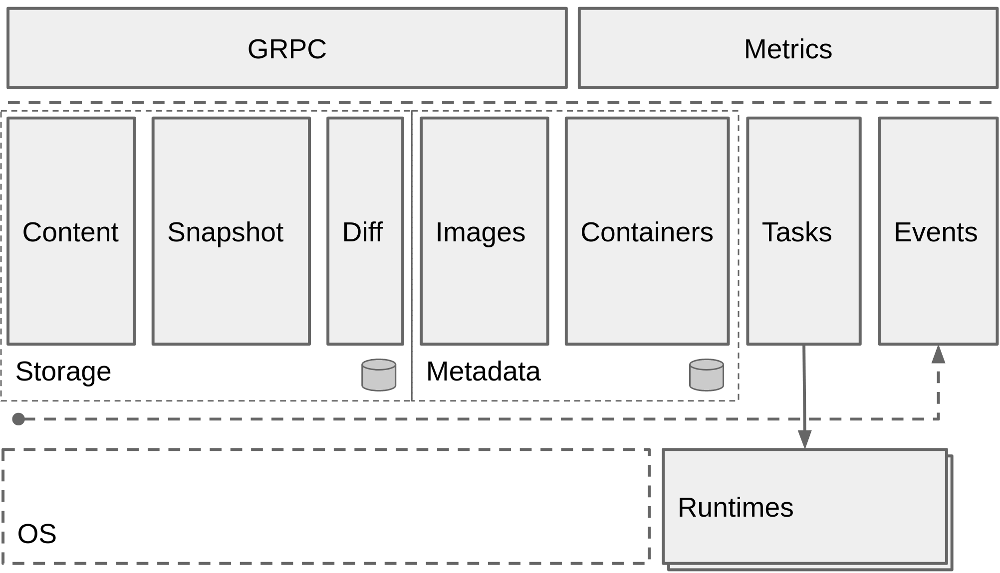

# containerd的安装和使用

Containerd是一个工业标准的容器运行时，重点是它简洁，健壮，便携，在Linux和window上可以作为一个守护进程运行，它可以管理主机系统上容器的完整的生命周期：镜像传输和存储，容器的执行和监控，低级别的存储和网络。

containerd和docker不同，containerd重点是继承在大规模的系统中，例如kubernetes，而不是面向开发者，让开发者使用，更多的是容器运行时的概念，承载容器运行。

containerd的架构图如下：

 

## 安装containerd

安装containerd这里写了一个脚本来快速部署，脚本会部署containerd和crictl命令行工具到机器上，crictl是CRI兼容的容器运行时命令行接口，可以用来操作containerd的镜像和容器等。

运行下面脚本需要填写2个参数，第一个是crictl的版本，第二个参数填写containerd版本，注意传入的版本号需要去掉开头的v。

crictl版本号获取地址: <https://github.com/kubernetes-sigs/cri-tools/tags>

containerd版本号获取地址: <https://github.com/containerd/containerd/tags>

crictl 默认连接到 unix:///var/run/dockershim.sock。 对于其他的运行时，你可以用多种不同的方法设置端点：

* 通过设置参数 --runtime-endpoint 和 --image-endpoint
* 通过设置环境变量 CONTAINER_RUNTIME_ENDPOINT 和 IMAGE_SERVICE_ENDPOINT
* 通过在配置文件中设置端点 --config=/etc/crictl.yaml

你还可以在连接到服务器并启用或禁用调试时指定超时值，方法是在配置文件中指定 timeout 或 debug 值，或者使用 --timeout 和 --debug 命令行参数。

install-containerd.sh内容如下

```
#!/bin/bash

crictl_version=$1
contained_version=$2

if [ $# = 0 ];then
  echo "Run 'sh install-containerd.sh --h' for more information on a command."
fi

if [[ $1 = "--h" ]];then
  echo "Please enter the first parameter enters the crictl version, the second parameter enters the containerd version

Usage: sh install-containerd.sh [crictl_version] [contained_version]"
fi


main(){
# download crictl client

wget https://github.com/kubernetes-sigs/cri-tools/releases/download/v${crictl_version}/crictl-v${crictl_version}-linux-amd64.tar.gz

tar -C /usr/local/bin -xf crictl-v${crictl_version}-linux-amd64.tar.gz

rm -rf crictl-v${crictl_version}-linux-amd64.tar.gz

# download containerd pkg

wget https://github.com/containerd/containerd/releases/download/v${contained_version}/containerd-${contained_version}-linux-amd64.tar.gz

tar -C /usr/local -xf containerd-${contained_version}-linux-amd64.tar.gz

rm -rf containerd-${contained_version}-linux-amd64.tar.gz

#crictl start config 

cat << EOF > /etc/crictl.yaml
runtime-endpoint: unix:///run/containerd/containerd.sock
image-endpoint: unix:///run/containerd/containerd.sock
timeout: 10
debug: false
EOF

# create contained config

mkdir -p  /etc/containerd
cd /usr/local/bin/
./containerd config default > /etc/containerd/config.toml

# systemd manager containerd

cat << EOF >  /lib/systemd/system/containerd.service
[Unit]
Description=containerd container runtime
Documentation=https://containerd.io
After=network.target

[Service]
ExecStartPre=/sbin/modprobe overlay
ExecStart=/usr/local/bin/containerd
Delegate=yes
KillMode=process
LimitNOFILE=1048576
# Having non-zero Limit*s causes performance problems due to accounting overhead
# in the kernel. We recommend using cgroups to do container-local accounting.
LimitNPROC=infinity
LimitCORE=infinity

[Install]
WantedBy=multi-user.target
EOF

# Start containerd and set it to start automatically 

sudo systemctl daemon-reload
sudo systemctl enable containerd.service
sudo systemctl start containerd.service
sudo systemctl status containerd.service

}

if [ $# = 2 ];then

main

fi
```

检查containerd的运行状态，如果提示running则说明安装成功

```
[root@VM-0-13-centos ~]# systemctl status containerd.service
● containerd.service - containerd container runtime
   Loaded: loaded (/usr/lib/systemd/system/containerd.service; enabled; vendor preset: disabled)
   Active: active (running) since Thu 2021-08-19 09:46:45 CST; 2 weeks 0 days ago
     Docs: https://containerd.io
 Main PID: 828192 (containerd)
   CGroup: /system.slice/containerd.service
   ...................
```

## crictl常用的命令

```
[root@VM-0-13-centos ~]# crictl -h
NAME:
   crictl - client for CRI

USAGE:
   crictl [global options] command [command options] [arguments...]

VERSION:
   v1.22.0

COMMANDS:
   attach              Attach to a running container
   create              Create a new container
   exec                Run a command in a running container
   version             Display runtime version information
   images, image, img  List images
   inspect             Display the status of one or more containers
   inspecti            Return the status of one or more images
   imagefsinfo         Return image filesystem info
   inspectp            Display the status of one or more pods
   logs                Fetch the logs of a container
   port-forward        Forward local port to a pod
   ps                  List containers
   pull                Pull an image from a registry
   run                 Run a new container inside a sandbox
   runp                Run a new pod
   rm                  Remove one or more containers
   rmi                 Remove one or more images
   rmp                 Remove one or more pods
   pods                List pods
   start               Start one or more created containers
   info                Display information of the container runtime
   stop                Stop one or more running containers
   stopp               Stop one or more running pods
   update              Update one or more running containers
   config              Get and set crictl client configuration options
   stats               List container(s) resource usage statistics
   completion          Output shell completion code
   help, h             Shows a list of commands or help for one command
```

crictl是没有构建命令的，如果想构建镜像可以用docker或者用buildah工具，buildah可以参考文档<https://github.com/containers/buildah>

containerd也有自带客户端工具，叫ctr，执行ctr命令时需要带上--namespace http://k8s.io，建议还是安装crictl工具操作。

## crictl配置私有镜像仓库

crictl是没有login命令的，如果需要拉取私有镜像仓库的镜像，需要在containerd的配置文件/etc/containerd/config.toml中配置私有镜像仓库的登录信息

```
[plugins]
    [plugins.cri.registry.mirrors."ccr.ccs.tencentyun.com"]
      endpoint = ["https://ccr.ccs.tencentyun.com"]

    [plugins.cri.registry.configs."ccr.ccs.tencentyun.com".auth]
      username = "xxxxx"
      password = "xxxxx"
```

配置好之后在重启containerd即可拉取私有镜像

```
# systemctl restart containerd.service
# crictl pull ccr.ccs.tencentyun.com/xxx/xxx:v1

```

## 配置镜像加速

有的时候为了能够加速镜像的拉取，需要配置镜像加速的代理，可以在/etc/containerd/config.toml配置镜像加速

```
[plugins]
    [plugins.cri.registry.mirrors."docker.io"]
      endpoint = ["https://mirror.ccs.tencentyun.com","https://xxxx.mirror.aliyuncs.com"]
```

配置好之后在重启containerd即可生效

```
# systemctl restart containerd.service

```