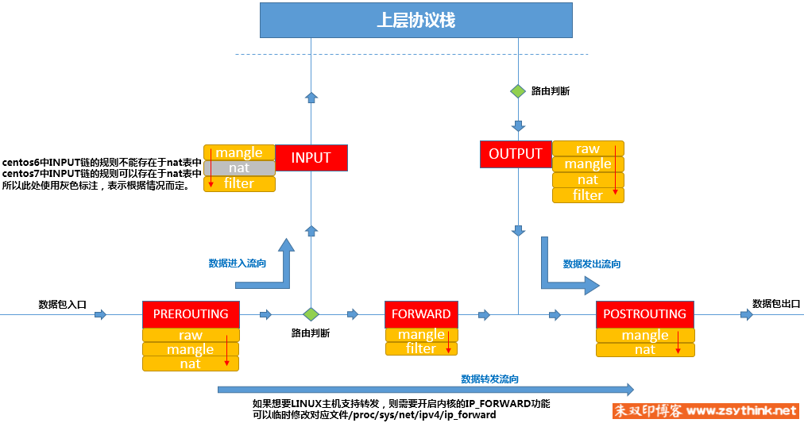

# iptables的表和链说明

 


# iptables处理动作

此处列出一些常用的动作，之后的文章会对它们进行详细的示例与总结：

* ACCEPT：允许数据包通过。
* DROP：直接丢弃数据包，不给任何回应信息，这时候客户端会感觉自己的请求泥牛入海了，过了超时时间才会有反应。
* REJECT：拒绝数据包通过，必要时会给数据发送端一个响应的信息，客户端刚请求就会收到拒绝的信息。
* SNAT：源地址转换，解决内网用户用同一个公网地址上网的问题。
* MASQUERADE：是SNAT的一种特殊形式，适用于动态的、临时会变的ip上。
* DNAT：目标地址转换。
* REDIRECT：在本机做端口映射。
* LOG：在/var/log/messages文件中记录日志信息，然后将数据包传递给下一条规则，也就是说除了记录以外不对数据包做任何其他操作，仍然让下一条规则去匹配。
* MIRROR: 镜像数据包，也就是将来源 IP 与目的地 IP 对调后，将数据包送回，进行完此处理动作后，将会中断过滤程序
* QUEUE: 中断过滤程序，将数据包放入队列，交给其它程序处理。透过自行开发的处理程序，可以进行其它应用，例如：计算联机费.......等
* RETURN: 结束在目前规则链中的过滤程序，返回主规则链继续过滤，如果把自订规则链看成是一个子程序，那么这个动作，就相当提早结束子程序并返回到主程序中
* MARK: 将数据包标上某个代号，以便提供作为后续过滤的条件判断依据，进行完此处理动作后，将会继续比对其它规则

## REJECT

REJECT动作的常用选项为–reject-with

使用–reject-with选项，可以设置提示信息，当对方被拒绝时，会提示对方为什么被拒绝。

可用值如下

* icmp-net-unreachable
* icmp-host-unreachable
* icmp-port-unreachable
* icmp-proto-unreachable
* icmp-net-prohibited
* icmp-host-pro-hibited
* icmp-admin-prohibited

当不设置任何值时，默认值为icmp-port-unreachable。

## SNAT

配置SNAT，可以隐藏网内主机的IP地址，也可以共享公网IP，访问互联网，如果只是共享IP的话，只配置如下SNAT规则即可。

```
iptables -t nat -A POSTROUTING -s 10.1.0.0/16 -j SNAT --to-source 公网IP
```

## MASQUERADE

动态的SNAT操作，如下命令表示将10.1网段的报文的源IP修改为eth0网卡中可用的地址

```
iptables -t nat -A POSTROUTING -s 10.1.0.0/16 -o eth0 -j MASQUERADE
```

## REDIRECT

在本机进行目标端口映射时可以使用REDIRECT动作。

```
iptables -t nat -A PREROUTING -p tcp --dport 80 -j REDIRECT --to-ports 8080
```


# iptables查询参数说明

* -L: 查看列表
* -t: 查看指定表，默认是filter表
* -v: 显示详情信息
* -n: 表示不对IP地址进行名称反解，直接显示IP地址
* --line-numbers: 显示规则编号
* -x: 选项表示显示计数器的精确值

  
常用命令：

```
iptables -t 表名 -L
iptables -t 表名 -L 链名
iptables -t 表名 -v -L
iptables -t 表名 -v -x -L
```

# iptables规则配置参数说明

* -F: 选项为flush之意，即冲刷指定的链，即删除指定链中的所有规则
* -I: 指明将”规则”插入至哪个链中，-I表示insert，即插入的意思，所以-I INPUT表示将规则插入于INPUT链中，即添加规则之意，-I表示在链的首部插入规则
* -s: 指明”匹配条件”中的”源地址”，即如果报文的源地址属于-s对应的地址，那么报文则满足匹配条件，-s为source之意，表示源地址。
* -j: 指明当”匹配条件”被满足时，所对应的动作
* -A: 为append之意，所以，-A INPUT则表示在INPUT链中追加规则，-A表示在链的尾部追加规则
* -D: 选项表示删除指定链中的某条规则
* -R: 选项表示修改指定的链
* -P: 修改链的默认策略


-I INPUT 2表示在INPUT链中新增规则，新增的规则的编号为2，不指定编号，默认是在最上面。

-D INPUT 3表示删除INPUT链中的第3条规则

-R 选项修改某个规则时，必须指定规则对应的原本的匹配条件（如果有多个匹配条件，都需要指定）。

-P FORWARD DROP表示将表中FORWRD链的默认策略改为DROP

# 规则保存和还原

将规则重定向到/etc/sysconfig/iptables文件中即可

```
iptables-save > /etc/sysconfig/iptables 
```

将/etc/sysconfig/iptables中的规则重新载入为当前的iptables规则

```
iptables-restore < /etc/sysconfig/iptables
```

# 规则详细参数配置

* -p: 指定需要匹配的报文的协议类型
* -s: 可以匹配报文的源地址，指定源地址时，一次指定多个，用”逗号”隔开即可，！-s表示取反
* -d: 指定”目标地址”作为匹配条件，！-d表示取反
* -i: 指定网卡名
* -o: 选项用于匹配报文将从哪个网卡流出
* --dport: 指定目标端口
* --sport: 指定源端口

指定目的和源端口需要引用模块

```
iptables -t filter -I INPUT -s 192.168.0.1 -p tcp -m tcp --dport -j REJECT
```

我们就使用了扩展匹配条件--dport，指定了匹配报文的目标端口，如果外来报文的目标端口为本机的22号端口（ssh默认端口），则拒绝之，而在使用--dport之前，我们使用-m选项，指定了对应的扩展模块为tcp，也就是说，如果想要使用--dport这个扩展匹配条件，则必须依靠某个扩展模块完成，上例中，这个扩展模块就是tcp扩展模块，最终，我们使用的是tcp扩展模块中的dport扩展匹配条件。

当使用-p选项指定了报文的协议时，如果在没有使用-m指定对应的扩展模块名称的情况下，使用了扩展匹配条件，  iptables默认会调用与-p选项对应的协议名称相同的模块。

指定目的或者源端口范围：

* --dport 22:25 表示目标端口为22到25之间的所有端口
* --dport 22:   表示匹配0号到22号之间的所有端口
* --dport :22   表示匹配80号端口以及其以后的所有端口（直到65535）


# iptables模块

## tcp扩展模块

常用的扩展匹配条件如下：

-p tcp -m tcp --sport 用于匹配tcp协议报文的源端口，可以使用冒号指定一个连续的端口范围

-p tcp -m tcp --dport 用于匹配tcp协议报文的目标端口，可以使用冒号指定一个连续的端口范围

```
#示例如下
iptables -t filter -I OUTPUT -d 192.168.1.146 -p tcp -m tcp --sport 22 -j REJECT
iptables -t filter -I INPUT -s 192.168.1.146 -p tcp -m tcp --dport 22:25 -j REJECT
iptables -t filter -I INPUT -s 192.168.1.146 -p tcp -m tcp --dport :22 -j REJECT
iptables -t filter -I INPUT -s 192.168.1.146 -p tcp -m tcp --dport 80: -j REJECT
iptables -t filter -I OUTPUT -d 192.168.1.146 -p tcp -m tcp ! --sport 22 -j ACCEPT
```

## multiport扩展模块

常用的扩展匹配条件如下：

-p tcp -m multiport --sports 用于匹配报文的源端口，可以指定离散的多个端口号,端口之间用”逗号”隔开

-p udp -m multiport --dports 用于匹配报文的目标端口，可以指定离散的多个端口号，端口之间用”逗号”隔开

```
#示例如下
iptables -t filter -I OUTPUT -d 192.168.1.146 -p udp -m multiport --sports 137,138 -j REJECT
iptables -t filter -I INPUT -s 192.168.1.146 -p tcp -m multiport --dports 22,80 -j REJECT
iptables -t filter -I INPUT -s 192.168.1.146 -p tcp -m multiport ! --dports 22,80 -j REJECT
iptables -t filter -I INPUT -s 192.168.1.146 -p tcp -m multiport --dports 80:88 -j REJECT
iptables -t filter -I INPUT -s 192.168.1.146 -p tcp -m multiport --dports 22,80:88 -j REJECT
```

## iprange模块

包含的扩展匹配条件如下

--src-range：指定连续的源地址范围

--dst-range：指定连续的目标地址范围

```
#示例
iptables -t filter -I INPUT -m iprange --src-range 192.168.1.127-192.168.1.146 -j DROP
iptables -t filter -I OUTPUT -m iprange --dst-range 192.168.1.127-192.168.1.146 -j DROP
iptables -t filter -I INPUT -m iprange ! --src-range 192.168.1.127-192.168.1.146 -j DROP
```

## string模块

常用扩展匹配条件如下

--algo：指定对应的匹配算法，可用算法为bm、kmp，此选项为必需选项。

--string：指定需要匹配的字符串

```
#示例
iptables -t filter -I INPUT -p tcp --sport 80 -m string --algo bm --string "OOXX" -j REJECT
iptables -t filter -I INPUT -p tcp --sport 80 -m string --algo bm --string "OOXX" -j REJECT
```

## time模块

常用扩展匹配条件如下

--timestart：用于指定时间范围的开始时间，不可取反

--timestop：用于指定时间范围的结束时间，不可取反

--weekdays：用于指定”星期几”，可取反

--monthdays：用于指定”几号”，可取反

--datestart：用于指定日期范围的开始日期，不可取反

--datestop：用于指定日期范围的结束时间，不可取反

```
iptables -t filter -I OUTPUT -p tcp --dport 80 -m time --timestart 09:00:00 --timestop 19:00:00 -j REJECT
iptables -t filter -I OUTPUT -p tcp --dport 443 -m time --timestart 09:00:00 --timestop 19:00:00 -j REJECT
iptables -t filter -I OUTPUT -p tcp --dport 80  -m time --weekdays 6,7 -j REJECT
iptables -t filter -I OUTPUT -p tcp --dport 80  -m time --monthdays 22,23 -j REJECT
iptables -t filter -I OUTPUT -p tcp --dport 80  -m time ! --monthdays 22,23 -j REJECT
iptables -t filter -I OUTPUT -p tcp --dport 80  -m time --timestart 09:00:00 --timestop 18:00:00 --weekdays 6,7 -j REJECT
iptables -t filter -I OUTPUT -p tcp --dport 80  -m time --weekdays 5 --monthdays 22,23,24,25,26,27,28 -j REJECT
iptables -t filter -I OUTPUT -p tcp --dport 80  -m time --datestart 2017-12-24 --datestop 2017-12-27 -j REJECT
``` 

## connlimit 模块
常用的扩展匹配条件如下

--connlimit-above：单独使用此选项时，表示限制每个IP的链接数量。

--connlimit-mask：此选项不能单独使用，在使用--connlimit-above选项时，配合此选项，则可以针对”某类IP段内的一定数量的IP”进行连接数量的限制，如果不明白可以参考上文的详细解释。

示例

```
iptables -I INPUT -p tcp --dport 22 -m connlimit --connlimit-above 2 -j REJECT
iptables -I INPUT -p tcp --dport 22 -m connlimit --connlimit-above 20 --connlimit-mask 24 -j REJECT
iptables -I INPUT -p tcp --dport 22 -m connlimit --connlimit-above 10 --connlimit-mask 27 -j REJECT
```

## limit模块

常用的扩展匹配条件如下

--limit-burst：类比”令牌桶”算法，此选项用于指定令牌桶中令牌的最大数量，上文中已经详细的描述了”令牌桶”的概念，方便回顾。

--limit：类比”令牌桶”算法，此选项用于指定令牌桶中生成新令牌的频率，可用时间单位有second、minute 、hour、day。

示例 

```
iptables -t filter -I INPUT -p icmp -m limit --limit-burst 3 --limit 10/minute -j ACCEPT
iptables -t filter -A INPUT -p icmp -j REJECT
```

# 自定义链

自定义链参数说明:

* -N: -N IN_WEB表示创建一个自定义链，自定义链的名称为IN_WEB
* -E: 选项可以修改自定义链名
* -X: 选项可以删除自定义链，删除满足条件:1.自定义链没有被任何默认链引用，即自定义链的引用计数为0; 2.自定义链中没有任何规则，即自定义链为空。

```
# 创建自定义链
iptables -t filter -N IN_WEB
# 往自定义链添加规则
iptables -t filter -I IN_WEB -s 192.168.1.1 -j REJECT
# 引用自定义链
iptables -t filter -I INPUT -p tcp --dport 80 -j IN_WEB
# 重命名自定义链
iptables -E IN_WEB WEB
# 删除自定义链
iptables -X WEB
```

# iptables作为防火墙的前提

```
#使用如下命令查看当前主机是否已经开启了核心转发，0表示为开启，1表示已开启
cat /proc/sys/net/ipv4/ip_forward
#使用如下两种方法均可临时开启核心转发，立即生效，但是重启网络配置后会失效。
方法一：echo 1 > /proc/sys/net/ipv4/ip_forward
方法二：sysctl -w net.ipv4.ip_forward=1
#使用如下方法开启核心转发功能，重启网络服务后永久生效。
配置/etc/sysctl.conf文件（centos7中配置/usr/lib/sysctl.d/00-system.conf文件），在配置文件中将 net.ipv4.ip_forward设置为1
```

# iptables白名单

先添加一条默认拒绝的规则，然后再为需要放行的报文设置规则

```
iptables -A FORWARD -j REJECT
iptables -I FORWARD -s 10.1.0.0/16 -p tcp --dport 80 -j ACCEPT
iptables -I FORWARD -d 10.1.0.0/16 -p tcp --sport 80 -j ACCEPT
iptables -I FORWARD -s 10.1.0.0/16 -p tcp --dport 22 -j ACCEPT
iptables -I FORWARD -d 10.1.0.0/16 -p tcp --sport 22 -j ACCEPT
```

# 注意事项

1. 规则的顺序，相同服务的规则，更严格的规则应该放在前面。
2. 当规则中有多个匹配条件时，条件之间默认存在”与”的关系。
3. 更容易被匹配到的规则放置在前面。
4. IPTABLES所在主机作为网络防火 墙时，在配置规则时，应着重考虑方向性，双向都要考虑，从外到内，从内到外。
5. 在配置IPTABLES白名单时，往往会将链的默认策略设置为ACCEPT，通过在链的最后设置REJECT规则实现白名单机制，而不是将链的默认策略设置为DROP，如果将链的默认策略设置为DROP，当链中的规则被清空时，管理员的请求也将会被DROP掉。

