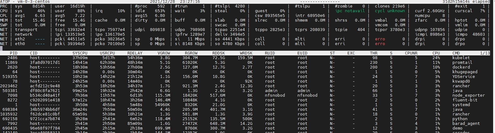

# Linux系统atop监控工具的安装和使用

atop就是一款用于监控Linux系统资源与进程的工具，它以一定的频率记录系统的运行状态，所采集的数据包含系统CPU、内存、磁盘、网络的资源使用情况和进程运行情况，并能以日志文件的方式保存在磁盘中，服务器出现问题后，可获取相应的atop日志文件进行分析。

## atop的安装

```
Centos: yum -y install atop
Ubuntu: apt -y install atop
```

## atop的启停

```
systemctl start atop
systemctl restart atop
systemctl stop atop
systemctl status atop
```

## atop的配置文件

atop的启动配置文件是/etc/sysconfig/atop

```
[root@vm-0-3-centos atop]# cat /etc/sysconfig/atop
LOGOPTS=""
LOGINTERVAL=600
LOGGENERATIONS=28
LOGPATH=/var/log/atop
```

* LOGINTERVAL=600 表示将默认的600s监控周期修改为30s。建议修改为30s，您可结合实际情况进行修改。
* LOGGENERATIONS=28 表示将默认的日志保留时间28天修改为7天。为避免 atop 长时间运行占用太多磁盘空间，建议修改为7天，您可结合实际情况进行修改。
* LOGPATH=/var/log/atop 表示日志文件的存储路径，可以用默认的。

```
# sed -i "s/LOGINTERVAL=600/LOGINTERVAL=30/" /etc/sysconfig/atop
# sed -i "s/LOGGENERATIONS=28/LOGGENERATIONS=7/" /etc/sysconfig/atop
```

## atop日志分析

这里当linux出现资源使用过高，想查看下当时是什么进程导致的，可以从日志里分析，用atop -r atop_xxxxx分析日志文件

```
[root@vm-0-3-centos ~]# cd /var/log/atop/
[root@vm-0-3-centos atop]# ll
total 131380
-rw-r--r-- 1 root root 134526756 Dec 28 23:48 atop_20211228
[root@vm-0-3-centos atop]# atop -r atop_20211228
```

 


atop常用命令

您可在打开日志文件后，使用以下命令筛选所需数据：

* c：按照进程的CPU使用率降序筛选。
* m：按照进程的内存使用率降序筛选。
* d：按照进程的磁盘使用率降序筛选。
* a：按照进程资源综合使用率进行降序筛选。
* n：按照进程的网络使用率进行降序筛选（使用此命令需安装额外的内核模块，默认不支持）。
* t：跳转到下一个监控采集点。
* T：跳转到上一个监控采集点。
* b：指定时间点，格式为 YYYYMMDDhhmm。


监控字段主要参数说明如下：

* ATOP 行：主机名、信息采样日期和时间点。
* PRC 行：进程整体运行情况。
* sys 及 user：CPU 被用于处理进程时，进程在内核态及用户态所占 CPU 的时间比例。
* \#proc：进程总数。
* \#zombie：僵死进程的数量。
* \#exit：Atop 采样周期期间退出的进程数量。
* CPU 行：CPU 整体（即多核 CPU 作为一个整体 CPU 资源）的使用情况。CPU 行的各字段数值相加结果为 N00%，N 为 CPU 核数。
* sys 及 user：CPU 被用于处理进程时，进程在内核态及用户态所占 CPU 的时间比例。
* irq：CPU 被用于处理中断的时间比例。
* idle：CPU 处在完全空闲状态的时间比例。
* wait：CPU 处在“进程等待磁盘 IO 导致 CPU 空闲”状态的时间比例。
* CPL 行：CPU 负载情况。
* avg1、avg5 和 avg15：过去1分钟、5分钟和15分钟内运行队列中的平均进程数量。
* csw：指示上下文交换次数。
* intr：指示中断发生次数。
* MEM 行：内存的使用情况。
* tot：物理内存总量。
* cache ：用于页缓存的内存大小。
* buff：用于文件缓存的内存大小。
* slab：系统内核占用的内存大小。
* SWP 行：交换空间的使用情况。
* tot：交换区总量。
* free：空闲交换空间大小。
* PAG 行：虚拟内存分页情况
* swin 及 swout：换入和换出内存页数。
* DSK 行：磁盘使用情况，每一个磁盘设备对应一列。如果有 sdb 设备，那么增加一行 DSK 信息。
* sda：磁盘设备标识。
* busy：磁盘忙时比例。
* read 及 write：读、写请求数量。
* NET 行：多列 NET 展示了网络状况，包括传输层（TCP 和 UDP）、IP 层以及各活动的网口信息。
* xxxxxi：各层或活动网口收包数目。
* xxxxxo：各层或活动网口发包数目。


