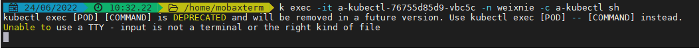
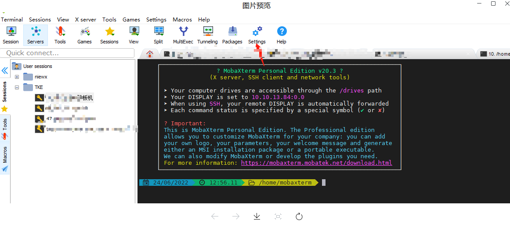
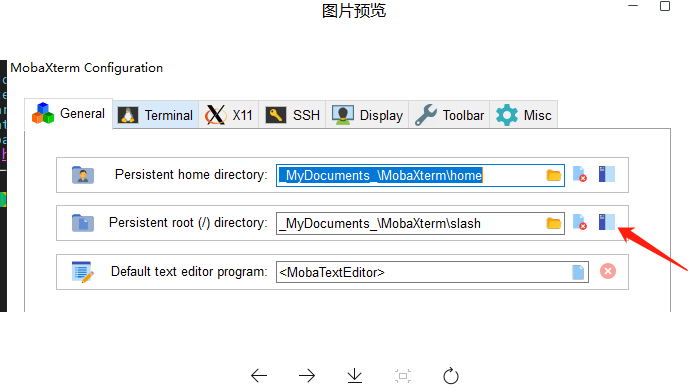
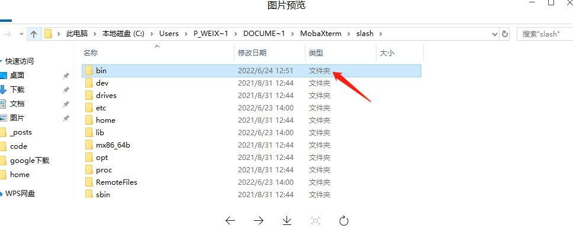
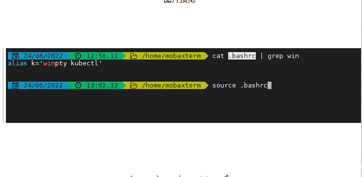
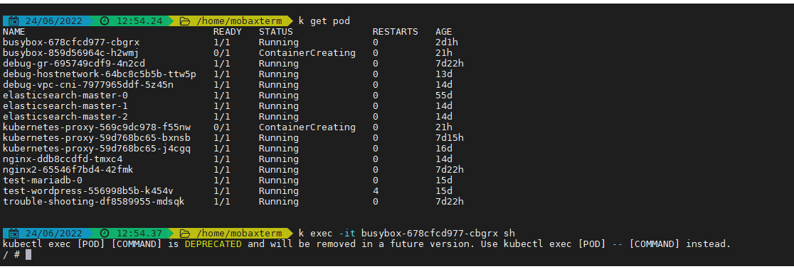

# MobaXterm本地终端执行kubectl exec报错unable to use TTY

## 问题现象

MobaXterm本地终端执行kubectl exec报错Unable to use a TTY - input is not a terminal or the right kind of file

 

## 解决方案

参考文档https://segmentfault.com/a/1190000021307781?utm_source=tag-newe

* 首先下载winpty

通过链接下载winpty <https://github.com/rprichard/winpty/releases/download/0.4.3/winpty-0.4.3-cygwin-2.8.0-x64.tar.gz> 

* 将winpty.exe放到本地bin目录

找到本地终端bin目录，可以将kubectl.exe和winpty.exe放到这个目录下

 

 

 

* 设置alias
  
具体简写名称可以根据自己习惯设置

 

* 测试kubectl exec报错Unable
  
测试kubectl exec登陆pod是否正常

 

