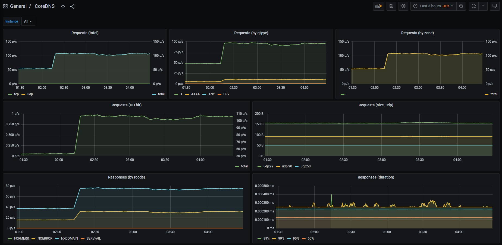

# prometheus监控k8s集群coredns

k8s中的域名解析的主流方案是coredns，kubeadm默认是会在集群部署coredns，一般k8s都会部署coredns，并且coredns有默认提供监控metrics的接口，下面我们来来说说如何用prometheus来采集coredns的监控数据。这里我们prometheus的用的是operater创建的，通过serviceMontor来监控coredns的service。

## 创建监控接口的servcie

正常我们在集群默认部署的coredns，会自动创建一个kube-dns的service，业务pod内就是通过访问这个service来用coredns进行域名的解析。coredns默认用9153端口提供了metrics接口，因此我们还需要新建一个service，用来暴露coredns的9153端口。

```
apiVersion: v1
kind: Service
metadata:
  name: coredns-metrics
  namespace: kube-system
  labels:
    app: cordns  
spec:
  ports:
  - name: 9153-9153-tcp
    port: 9153
    protocol: TCP
    targetPort: 9153
  selector:
    k8s-app: kube-dns
  sessionAffinity: None
  type: ClusterIP
```

## 配置serviceMontor采集监控数据

```
apiVersion: monitoring.coreos.com/v1
kind: ServiceMonitor
metadata:
  name: coredns-servicemonitors
  namespace: kube-system
spec:
  endpoints:
  - bearerTokenSecret:
      key: ""
    interval: 15s
    port: 9153-9153-tcp
  namespaceSelector:
    matchNames:
    - kube-system
  selector:
    matchLabels:
      app: cordns
```

除了用serviceMontor配置，也可以用RawJobs配置

```
scrape_configs:
- job_name: coredns-metrics
  honor_labels: true
  honor_timestamps: true
  scrape_interval: 15s
  metrics_path: /metrics
  scheme: http
  kubernetes_sd_configs:
  - role: endpoints
    namespaces:
      names:
      - kube-system
  relabel_configs:
  - source_labels: [__config_type]
    separator: ;
    regex: service
    target_label: __config_type
    replacement: $1
    action: replace
  - source_labels: [__meta_kubernetes_endpoint_port_name]
    separator: ;
    regex: 9153-9153-tcp
    replacement: $1
    action: keep
  - source_labels: [__meta_kubernetes_service_name]
    separator: ;
    regex: coredns-metrics
    replacement: $1
    action: keep
  - source_labels: [__meta_kubernetes_pod_node_name]
    separator: ;
    regex: (.*)
    target_label: node
    replacement: $1
    action: replace
  - source_labels: [__meta_kubernetes_namespace]
    separator: ;
    regex: (.*)
    target_label: namespace
    replacement: $1
    action: replace
  - source_labels: [__meta_kubernetes_service_name]
    separator: ;
    regex: (.*)
    target_label: service
    replacement: $1
    action: replace
  - source_labels: [__meta_kubernetes_pod_name]
    separator: ;
    regex: (.*)
    target_label: pod
    replacement: $1
    action: replace
  - source_labels: [__meta_kubernetes_endpoint_port_name]
    separator: ;
    regex: (.*)
    target_label: endpoint
    replacement: $1
    action: replace
```

## grafana配置coredns监控面板

可以到grafana的官网文档中找相关的dashboard，可以用5926这个面板，导入面板后，就可以查看coredns的监控了。

 


